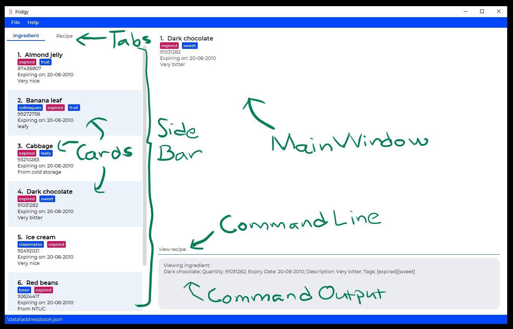

# Fridgy

## What is Fridgy?
---
* Fridgy is **a Food Inventory Manager** that makes it easy to reduce food waste by keeping track of what you have and when it expires.
* Fridgy's built-in **Recipe Tracker** matches recipe ingredients to ingredients in your inventory and helps to keep track of the quantity of ingredients.

## Our Motivation
---

It can be hard for the typical adult who cooks often to stay on top of the ingredients that they have in their pantry, as they may be too busy to actively keep track of them.

This can result in food wastage, in the form of constantly throwing away expired food.

Fridgy was thus developed to solve the issue of having to manually track ingredients (and their expiry dates) in a pantry.

## Who is it meant for?
---
* Households or individuals who want to keep track of groceries for meal preparation.
* Households or individuals who want to reduce food wastage.
* Individuals who are comfortable with a Command Line Interface (CLI).

## Example Usages
---
* As a user, you can add an ingredient (along with quantity and expiry information) in your pantry for tracking through the Command Line.
  * You can also delete, view or edit information related to the ingredient.
* As a user, you can add a recipe to Fridgy through the Command Line.
  * You can also delete, view or edit the recipe.
* Easily search for a previously added recipe or ingredient by name.
---
This project is based on the AddressBook-Level3 project created by the [SE-EDU initiative](https://se-education.org).
