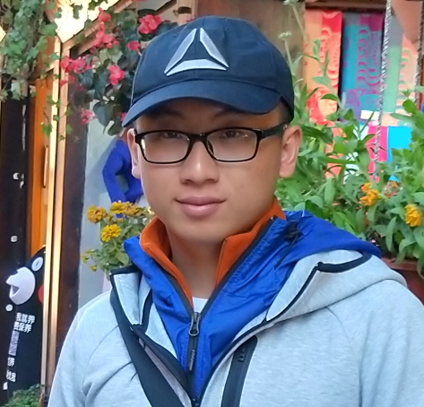
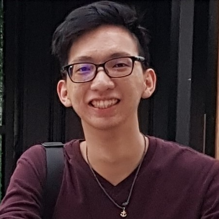
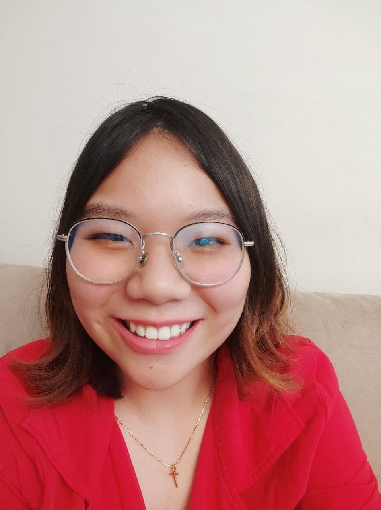

We are a team based in the [School of Computing, National University of Singapore](http://www.comp.nus.edu.sg).

You can reach us at the email `seer[at]comp.nus.edu.sg`

## Project team

### Li Bailin

[[github](https://github.com/rootkie)]
[[portfolio](team/rootkie.md)]

* Role: DevOps / Team Lead
* Responsibilities: Project Architecture + Code quality

### Rebecca Chin

[[github](http://github.com/rebeccacxy)]
[[portfolio](team/rebeccacxy.md)]

* Role: Developer
* Responsibilities: Testing + UI

### Nay Lin Han

[[github](https://github.com/NayLin-H99)]
[[portfolio](team/naylin-h99.md)]

* Role: Developer
* Responsibilities: Code quality + Integration

### Alissa

[[github](http://github.com/alissayarmantho)]
[[portfolio](team/alissayarmantho.md)]

* Role: Developer
* Responsibilities: Scheduling and tracking + Git expert

### Patrick Tan

[[github](http://github.com/pattan9955)]
[[portfolio](team/pattan9955.md)]

* Role: Developer
* Responsibilities: Documentation + Testing
