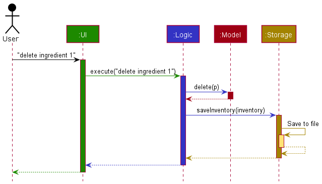
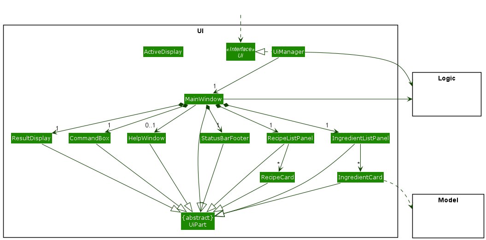
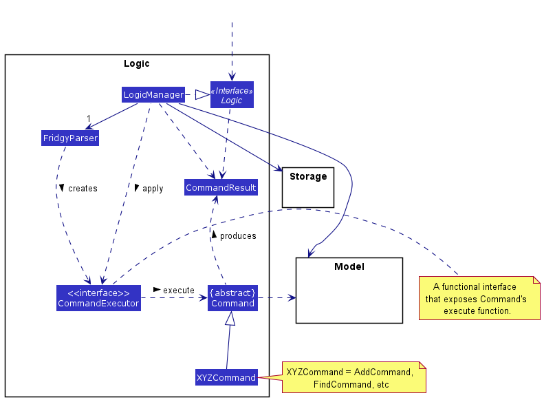
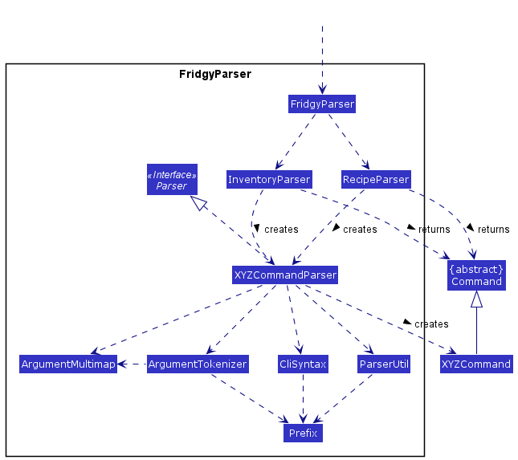
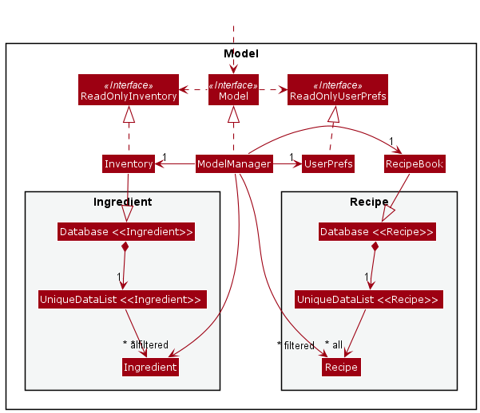
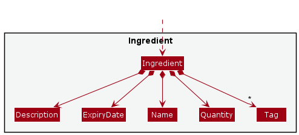
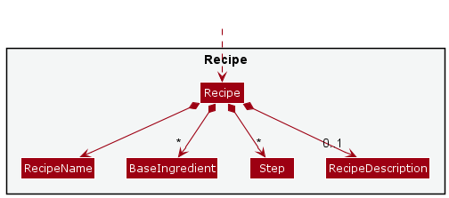

# Fridgy – Developer Guide

By: `Team Fridgy`

* Table of Contents
{:toc}

--------------------------------------------------------------------------------------------------------------------

# 1. **Overview**

This developer guide contains documentation on design architecture and details software design decisions in the implementation of Fridgy.
It is intended to be read by contributors, users, and future maintainers.

For more information on the Fridgy application, refer to the [_User Guide_](UserGuide.md) instead.

## 1.1 **About Fridgy**

Fridgy is a **food and recipe management system**, which aims to help users manage their ingredients and recipes easily.
It warns you about expiring ingredients, and automatically deducts your ingredients when you execute recipes.

Fridgy is a _desktop app_, optimized for use via a Command Line Interface (CLI), while having an interactive Graphical User Interface (GUI) to display ingredients and recipes. 
If you can type fast, Fridgy can get your fridge Inventory and recipe sorted out faster than traditional GUI apps.
 

## 1.2 **Setting up, Getting started**

Refer to the guide [_Setting up and getting started_](SettingUp.md).

--------------------------------------------------------------------------------------------------------------------

## 2. **Design**

:bulb: **Tip:** The `.puml` files used to create diagrams in this document can be found in the [diagrams](https://github.com/AY2122S1-CS2103T-W11-1/tp/tree/master/docs/diagrams/) folder. Refer to the [_PlantUML Tutorial_ at se-edu/guides](https://se-education.org/guides/tutorials/plantUml.html) to learn how to create and edit diagrams.

### 2.1 Architecture

The ***Architecture Diagram*** given above explains the high-level design of the App.

Given below is a quick overview of main components and how they interact with each other.

**Main components of the architecture**

**`Main`** has two classes called [`Main`](https://github.com/AY2122S1-CS2103T-W11-1/tp/tree/master/src/main/java/fridgy/Main.java) and [`MainApp`](https://github.com/AY2122S1-CS2103T-W11-1/tp/tree/master/src/main/java/fridgy/MainApp.java). It is responsible for,
* At app launch: Initializes the components in the correct sequence, and connects them up with each other.
* At shut down: Shuts down the components and invokes cleanup methods where necessary.

[**`Commons`**](#common-classes) represents a collection of classes used by multiple other components.

The rest of the App consists of four components.

* [**`UI`**](#ui-component): The UI of the App.
* [**`Logic`**](#logic-component): The command executor.
* [**`Model`**](#model-component): Holds the data of the App in memory.
* [**`Storage`**](#storage-component): Reads data from, and writes data to, the hard disk.

**How the architecture components interact with each other**

The *Sequence Diagram* below shows how the components interact with each other for the scenario where the user issues the command `delete ingredient 1`. It is similar for operations on `Recipe`.

Each of the four main components (also shown in the diagram above),

* defines its *API* in an `interface` with the same name as the Component.
* implements its functionality using a concrete `{Component Name}Manager` class (which follows the corresponding API `interface` mentioned in the previous point.

For example, the `Logic` component defines its API in the `Logic.java` interface and implements its functionality using the `LogicManager.java` class which follows the `Logic` interface. Other components interact with a given component through its interface rather than the concrete class (reason: to prevent outside component's being coupled to the implementation of a component), as illustrated in the (partial) class diagram below.

The sections below give more details of each component.

### 2.2 UI component

The **API** of this component is specified in [`Ui.java`](https://github.com/AY2122S1-CS2103T-W11-1/tp/tree/master/src/main/java/fridgy/ui/Ui.java)

The UI consists of:
1. `UIManager` which implements the `UI` interface, and hence is responsible for handling the initial setup when Fridgy is started e.g. initializing `MainWindow` and its parts. 
2. `MainWindow` that is made up of parts e.g.`CommandBox`, `ResultDisplay`, `ActiveDisplay`, `ingredientListPanel`, `recipeListPanel`, `StatusBarFooter` etc. All these, including the `MainWindow`, inherit from the abstract `UiPart` class which captures the commonalities between classes that represent parts of the visible GUI such as the handling of the interaction between these classes and their corresponding FXML files.

The `UI` component uses the JavaFx UI framework. As such, it follows closely to the typical JavaFX application structure. The layout of these UI parts are defined in matching `.fxml` files that are in the `src/main/resources/view` folder. For example, the layout of the [`MainWindow`](https://github.com/AY2122S1-CS2103T-W11-1/tp/tree/master/src/main/java/fridgy/ui/MainWindow.java) is specified in [`MainWindow.fxml`](https://github.com/AY2122S1-CS2103T-W11-1/tp/tree/master/src/main/resources/view/MainWindow.fxml)

The `UI` component,

* executes user commands using the `Logic` component.
* displays the result of the command execution to the UI part `ResultDisplay`
* logs the result of the command execution.
* listens for changes to `Model` data so that the UI can be updated with the modified data.
* keeps a reference to the `Logic` component, because the `UI` relies on the `Logic` to execute commands.
* depends on some classes in the `Model` component, as it displays `Ingredient` and `Recipe` object residing in the `Model`.

### 2.3 Logic component

**API** : [`Logic.java`](https://github.com/AY2122S1-CS2103T-W11-1/tp/tree/master/src/main/java/fridgy/logic/Logic.java)

Here is a (partial) class diagram of the `Logic` component:

How the `Logic` component works:
1. When `Logic` is called upon to execute a command, it uses the `FridgyParser` class to parse the user command.
1. `FridgyParser` parses the command string and returns a higher order function that exposes the execute interface of the resulting `Command` object which can communicate with a given `Model` when it is executed (e.g to add a recipe).
1. `Logic` applies the returned higher order function on the model it was constructed with.
1. The result of the execution is encapsulated as a `CommandResult` object which is returned back from `Logic`.

The Sequence Diagram below illustrates the interactions within the `Logic` component for the `execute("delete recipe 1")` API call.

:information_source: **Note:** The lifeline for `DeleteCommandParser` should end at the destroy marker (X) but due to a limitation of PlantUML, the lifeline reaches the end of diagram.

Here are the other classes in `Logic` (omitted from the class diagram above) that are used for parsing a user command:

How the parsing works:
* When called upon to parse a user command, the `FridgyParser` class checks if the command is a 'Typed' command (i.e. a command that pertains to Inventory or Recipes) or a 'General' command (such as "help" or "exit").
* "Typed" commands are sent to either `RecipeParser` or `InventoryParser` depending on the command type, while "General" commands are handled in `FridgyParser` directly.
* Inside `RecipeParser`/`InventoryParser`, commands that utilize arguments and require additional parsing will cause an `XYZCommandParser` (`XYZ` is a placeholder for the specific command name e.g. `AddCommandParser`) to be created.
* This `XYZCommandParser` is used to parse additional arguments and creates the `XYZCommand` object.
* The `FridgyParser` class then returns the `XYZCommand` object wrapped in an executable `CommandExecutor` that can be applied on a provided `Model` and return a `CommandResult.`
* All `XYZCommandParser` classes (e.g., `AddCommandParser`, `DeleteCommandParser`, ...) inherit from the `Parser` interface so that they can be treated similarly where possible e.g, during testing.

### 2.4 Model component
**API** : [`Model.java`](https://github.com/AY2122S1-CS2103T-W11-1/tp/tree/master/src/main/java/fridgy/model/Model.java)

The `Model` component,

* stores the Fridgy data i.e., all `Ingredient` and `Recipe` objects (which are contained in a `Database<Ingredient>` / `Database<Recipe` object).
* stores the currently 'selected' `Ingredient` and `Recipe` objects (e.g., results of a search query) as a separate _filtered_ list which is exposed to outsiders as an unmodifiable `ObservableList<Ingredient>` and `Recipe` that can be 'observed' e.g. the UI can be bound to this list so that the UI automatically updates when the data in the list change.
* stores the 'active' `Ingredient` or `Recipe` object that is displayed in detail in the UI component
* stores a `UserPref` object that represents the user’s preferences. This is exposed to the outside as a `ReadOnlyUserPref` objects.
* does not depend on any of the other three components (as the `Model` represents data entities of the domain, they should make sense on their own without depending on other components)

The container for `Ingredient` is called `Inventory` and container for `Recipe` is called `RecipeBook`

The CRUD behavior of `Ingredient` and `Recipe` are similar as they are implemented using a generic base model `Database<T>` internally.

:information_source: **Note:** An alternative (arguably, a more OOP) model is given below. It has a `Tag` list in the `Inventory`, which `Ingredient` references. This allows `Inventory` to only require one `Tag` object per unique tag, instead of each `Person` needing their own `Tag` objects. 

### 2.5 Storage component

**API** : [`Storage.java`](https://github.com/AY2122S1-CS2103T-W11-1/tp/tree/master/src/main/java/fridgy/storage/Storage.java)

The `Storage` component,
* can save `RecipeBook` and `Inventory` data as well as user preference data in json format, and read them back into corresponding objects.
* inherits from both `InventoryStorage`, `RecipeBookStorage` and `UserPrefStorage`, which means it can be treated as either one (if only the functionality of only one is needed).
* depends on some classes in the `Model` component (because the `Storage` component's job is to save/retrieve objects that belong to the `Model`)

### 2.6 Common classes

Classes used by multiple components are in the `fridgy.commons` package.

--------------------------------------------------------------------------------------------------------------------

## 3. **Implementation**

This section describes some noteworthy details on how certain features are implemented.

### 3.1 Model Generic abstraction

At the fundamental level, both `Recipe` and `Ingredient` are using the same CRUD operations. To reduce code duplication, a generic class of `Database<T extends Eq>` is implemented.

:information_source: **Note:** `Eq` is an interface that ensures all objects entered into the Database has a weaker notion of equality defined by the developer.  

This implementation allow more flexibility in extending the application in the future. One can easily duplicate a database model by extending from the Database generic.

However, do note that this implementation is purely contained within Model component. The `ModelManager` is still a monolithic class that handles all operations from other components. That means all CRUD operations to new types of objects will need to be implemented and exposed through `ModelManager`.

### 3.2 Automatic Quantity Conversion

Currently, 
1. Accepted SI prefixes are:
   - `k`: for kilo-
   - `m`: for milli-
2. Accepted base units are:
   - `g`: for grams
   - `l`: for litres

Do note that the user can choose not to include any units. It will be processed as a unit-less quantity.  

The initial step is to use Regex to split the quantity into a `Double`, the SI prefix, and the base unit. The computation is done based on the prefix detected, and a relevant multiplier is used to convert the quantity into the base unit. 

This is done for any incoming ingredient before the quantity is stored, and there are future plans to utilise this for other computations, such as deducting a quantity of ingredients in the inventory when a recipe is executed.
This also requires consistency in units for each ingredient.

--------------------------------------------------------------------------------------------------------------------

## 4. **Documentation, logging, testing, configuration, dev-ops**

* [Documentation guide](Documentation.md)
* [Testing guide](Testing.md)
* [Logging guide](Logging.md)
* [Configuration guide](Configuration.md)
* [DevOps guide](DevOps.md)

--------------------------------------------------------------------------------------------------------------------

## 5. **Appendix A: Requirements**

### 5.1 Product scope

**Target user profile**:

* has a need to manage a significant number of ingredients and recipes
* prefer desktop apps over other types
* can type fast
* prefers typing to mouse interactions
* is reasonably comfortable using CLI apps

**Value proposition**: manage ingredients and recipes faster than a typical mouse/GUI driven app

 

### 5.2 User stories

Priorities: High (must have) - `***`, Medium (nice to have) - `**`, Low (unlikely to have) - `*`

| Priority | As a …​                                    | I want to …​                     | So that I can…​                                                    |
| -------- | ------------------------------------------ | ------------------------------ | ----------------------------------------------------------------------------- |
| `***`  | new user                                    | see the help menu                  | refer to instructions when I forget how to use the App                     |
| `**`   | new user exploring the app                  | see my inventory populated with some sample ingredients and recipes        | test out the features              |
| `**`   | new user ready to start using the app       | purge all current data             | get rid of sample/experimental data I used for exploring the app           |
| `***`  | user who stocks up on ingredients           | add an ingredient                  | keep track of its quantity and expiry date                                 |
| `***`  | user who wants to tidy my inventory         | delete an ingredient               | remove expired ingredients                                                 |
| `***`  | user who wants to update my stock           | edit an ingredient                 | update ingredient details to have an accurate list that reflects my fridge |
| `***`  | user who has a large inventory of ingredients  | find an ingredient                 | locate details of ingredients without having to go through the entire list |
| `***`  | user who wants a complete view of my inventory | list all ingredients            | easily view all ingredients                                                |
| `***`  | user who can be forgetful                   | sort ingredients by expiry date    | locate ingredients that are expired or expiring soon                       |
| `***`  | user who is organised                       | tag ingredients                    | categorise my ingredients easily                                           |
| `***`  | user who has new recipes                    | add a recipe                       | keep track of quantity of ingredients needed for a recipe                  |
| `***`  | user who changes my meal options            | delete a recipe                    | stop keeping track of the recipe I no longer want                          |
| `***`  | user who is flexible with my meals          | edit recipes                       | update and personalise recipe details                                      |
| `***`  | user who has a large collection of recipes  | find a recipe by name              | locate details of recipes without having to go through the entire list     |
| `***`  | user who wants a complete view of all my recipes | list all recipes              | easily view all recipes                                                    |
| `***`  | user who is organised                       | tag recipes                        | categorise my recipes easily                                               |
| `***`  | user who cooks meals                        | execute a recipe                   | update the quantity of ingredients I have used                             |
| `***`  | user who likes convenience                  | import my saved database           | start using it again quickly                                               |

*{More to be added}*

 

### 5.3 Use cases

(For all use cases below, the **System** is `Fridgy` and the **Actor** is the `user`, unless specified otherwise)

| Use Case       | Description                      |
| -------------- | -------------------------------- |
| [UC01](#UC01)   | Add ingredient                   |
| [UC02](#UC02)   | Delete ingredient                |
| [UC03](#UC03)   | Edit ingredient                  |
| [UC04](#UC04)   | Find ingredients                 |
| [UC05](#UC05)   | List ingredients                 |
| [UC06](#UC06)   | View ingredient                  |
| [UC07](#UC07)   | Add recipe                       |
| [UC08](#UC08)   | Delete recipe                    |
| [UC09](#UC09)   | Edit recipe                      |
| [UC10](#UC010)  | Find recipes                     |
| [UC11](#UC11)   | List recipes                     |
| [UC12](#UC12)   | View recipe                      |
| [UC13](#UC13)   | Execute recipe                   |

### 5.3.1 Ingredient Use Cases

**Use case: UC01 - Add ingredient**

**MSS**

1. User chooses to add an ingredient.
2. User provides its name, quantity, expiry date and an optional description.
3. Fridgy tags the ingredient with its expiry status, i.e. `expired` or `expiring soon`.
4. Fridgy adds the ingredient.
5. Fridgy displays a confirmation message and the newly added ingredient.

    Use case ends.

**Extensions**

* 1a. The user enters an invalid input format.
    * 1a1. Fridgy displays an error message.     

        Use case ends.
* 2a. The user enters an invalid parameter.
    * 2a1. Fridgy displays an error message.

      Use case ends.
* 2b. Fridgy detects a duplicate ingredient.
    * 2b1. Fridgy displays an error message.

      Use case ends.

 

**Use case: UC02 - Delete ingredient**

**MSS**

1. User chooses to delete an ingredient by specifying its index.
2. Fridgy removes the full quantity of the ingredient.
3. Fridgy displays a confirmation message for the ingredient deleted.

    Use case ends.

**Extensions**

* 1a. The user enters an invalid input format or index.
    * 1a1. Fridgy displays an error message.

      Use case ends.

 

**Use case: UC03 - Edit ingredient**

**MSS**

1. User chooses to edit a specific ingredient by specifying its index.
2. User provides the parameter(s) to be edited.
3. Fridgy edits the ingredient.
4. Fridgy displays a confirmation message and the edited ingredient.

    Use case ends.

**Extensions**

* 1a. The user enters an invalid input format or index.
    * 1a1. Fridgy displays an error message.

      Use case ends.
* 2a. The user enters an invalid parameter.
    * 2a1. Fridgy displays an error message.

      Use case ends.

 

**Use case: UC04 - Find ingredients**

**MSS**

1. User chooses to find a specific ingredient.
2. User provides the filter condition, i.e. name of ingredient.
3. Fridgy displays a filtered list of ingredients.

   Use case ends.

**Extensions**

* 1a. The user enters an invalid input format.
    * 1a1. Fridgy displays an error message.

      Use case ends.
* 2a. The user enters an invalid input parameter.
    * 2a1. Fridgy displays an error message.

      Use case ends.
* 2b. There are no ingredients that match the user's filter conditions.
    * 2b1. Fridgy displays an error message.

      Use case ends.

 

**Use case: UC05 - List ingredients**

**MSS**

1. User requests to list all ingredients.
2. Fridgy displays a list of all ingredients.

   Use case ends.

**Extensions**

* 1a. The user enters an invalid input format.
    * 1a1. Fridgy displays an error message.

      Use case ends.

 

**Use case: UC06 - View ingredient**

**MSS**

1. User requests to view an ingredient by specifying its index.
2. Fridgy displays detailed information of the ingredient.
3. Fridgy displays a confirmation message for the ingredient in view.

   Use case ends.

**Extensions**

* 1a. The user enters an invalid input format or index.
    * 1a1. Fridgy displays an error message.

      Use case ends.

 

### 5.3.2 Recipe Use Cases

**Use case: UC07 - Add Recipe**

**MSS**

1. User chooses to add a recipe.
2. User provides its name, ingredients and their respective quantities, recipe steps, and an optional description.
3. Fridgy creates the recipe.
4. Fridgy displays a confirmation message and the newly created recipe.

    Use case ends.

**Extensions**

* 1a. The user enters an invalid input format.
    * 1a1. Fridgy displays an error message.

      Use case ends.
* 2a. The user enters an invalid parameter.
    * 2a1. Fridgy displays an error message.

      Use case ends.

 

**Use case: UC08 - Delete Recipe**

**MSS**

1. User requests to delete a recipe by specifying its index.
2. Fridgy removes the recipe.
3. Fridgy displays a confirmation message for the recipe deleted.

   Use case ends.

**Extensions**

* 1a. The user enters an invalid input format or index.
    * 1a1. Fridgy displays an error message.

      Use case ends.

 

**Use case: UC09 - Edit Recipe**

**MSS**

1. User requests to edit a specific recipe by specifying its index.
2. User provides the parameter(s) to be edited.
3. Fridgy edits the recipe.
4. Fridgy displays a confirmation message and the edited recipe.

   Use case ends.

**Extensions**

* 1a. The user enters an invalid input format or index.
    * 1a1. Fridgy displays an error message.

      Use case ends.
* 2a. The user enters an invalid parameter.
    * 2a1. Fridgy displays an error message.

      Use case ends.

 

**Use case: UC10 - Find Recipes**

**MSS**

1. User chooses to find a specific recipe.
2. User provides the filter condition, i.e. name of recipe.
3. Fridgy displays a filtered list of recipes.

   Use case ends.

**Extensions**

* 1a. The user enters an invalid input format.
    * 1a1. Fridgy displays an error message.

      Use case ends.
* 2a. The user enters an invalid input parameter.
    * 2a1. Fridgy displays an error message.

      Use case ends.
* 2b. There are no recipes that match the user's filter conditions.
    * 2b1. Fridgy displays an error message.

      Use case ends.

 

**Use case: UC11 - List recipes**

**MSS**

1. User requests to list all recipes.
2. Fridgy displays a list of all recipes.

   Use case ends.

**Extensions**

* 1a. The user enters an invalid input format.
    * 1a1. Fridgy displays an error message.

      Use case ends.

 

**Use case: UC12 - View ingredient**

**MSS**

1. User requests to view a recipe by specifying its index.
2. Fridgy displays detailed information of the recipe.
3. Fridgy displays a confirmation message for the recipe in view.

   Use case ends.

**Extensions**

* 1a. The user enters an invalid input format or index.
    * 1a1. Fridgy displays an error message.

      Use case ends.

**Use case: UC13 - Execute Recipe**

**MSS**

1. User requests to execute a recipe by specifying its name.
2. Fridgy executes the recipe and deducts the respective quantities of ingredients.
3. Fridgy displays a confirmation message.

   Use case ends.

**Extensions**

* 1a. The user enters an invalid input format or name.
    * 1a1. Fridgy displays an error message.

      Use case ends.
* 2a. There are insufficient ingredients in the inventory to be deducted.
    * 2a1. Fridgy displays an error message, with the missing ingredients and their respective quantities.

      Use case ends.

 

### 5.4 Non-Functional Requirements

1.  Should work on any _mainstream OS_ as long as it has Java `11` or above installed.
2.  Should be able to hold up to 1000 ingredients / recipes without a noticeable sluggishness in performance for typical usage.
3.  A user with above average typing speed for regular English text (i.e. not code, not system admin commands) should be able to accomplish most of the tasks faster using commands than using the mouse.
4. Should be able to function without internet access.
5. Should be able to perform all actions from the command line.

 

### 5.5 Glossary

|   Term   |    Explanation  |
| -------- |------------------|
|**Fridge**            | A personalised storage for ingredients. |
|**Ingredient**        | A food item kept in a Fridge, that can be combined to make a meal. |
|**Recipe**            | A set of steps that details how to prepare a meal, and the ingredients with their respective quantities required. |
|**GUI**               | A graphical user interface, i.e. the visual display of Fridgy |
|**Mainstream OS**     | Windows, Linux, Unix, OS-X. |
|**SI prefix**         | SI prefixes are a standard defined by the International System of Units such as kilo-, milli-, centi- and so on. |

--------------------------------------------------------------------------------------------------------------------

## 6. **Appendix B: Instructions for manual testing**

Given below are instructions to test the app manually.

:information_source: **Note:** These instructions only provide a starting point for testers to work on;
testers are expected to do more *exploratory* testing.

 

### 6.1 Launch and shutdown

1. Initial launch

   1. Download the jar file and copy into an empty folder

   1. Double-click the jar file Expected: Shows the GUI with a set of sample ingredients and recipes. The window size may not be optimum.

1. Saving window preferences

   1. Resize the window to an optimum size. Move the window to a different location. Close the window.

   1. Re-launch the app by double-clicking the jar file. 
       Expected: The most recent window size and location is retained.

1. _{ more test cases …​ }_

 

### 6.2 Deleting an ingredient

1. Deleting an ingredient while all ingredients are being shown

   1. Prerequisites: List all ingredients using the `list` command. Multiple ingredients in the list.

   2. Test case: `delete 2` 
      Expected: Second ingredient is deleted from the list. Details of the deleted ingredient shown in the status message.

   3. Test case: `delete 0` 
      Expected: No ingredient is deleted. Error details shown in the status message.

   4. Other incorrect delete commands to try: `delete`, `delete x`, `...` (where x is larger than the list size) 
      Expected: Similar to previous.

 

### 6.3 Saving data

1. Dealing with missing/corrupted data files

   1a. To simulate missing file, create an empty directory and run the program. Program should create a new file in the directory.

   1b. To simulate a corrupted file, replace content in file with wrong or unexpected content. Program should throw an error.

