By: `Team Fridgy`

## Table of Contents
* Table of Contents
{:toc}

--------------------------------------------------------------------------------------------------------------------
## 1. Introduction

Fridgy is a **food and recipe management system**, for users to manage their ingredients and recipes easily.

Fridgy helps you track your ingredients and recipes. It also warns you about expiring and expired ingredients, and automatically deducts your ingredients when you cook recipes.

Fridgy is made for people living in shared spaces, since fridges can get *very messy* and difficult to keep track of!
It is a *desktop app*, optimized for use via a Command Line Interface (CLI), with an interactive Graphical User Interface (GUI) to display ingredients and recipes! If you can type fast, Fridgy can get your fridge Inventory and Recipe Book sorted out faster than traditional GUI apps.

Want to know more? Jump to [Section 2, Quick Start](#2-quick-start) to get started.

### 1.1 Navigating the User Guide

This user guide aims to provide a comprehensive guide on how to use Fridgy.
In addition, the quick start guide provides an end-to-end process to help you get started with installing Fridgy.

This User Guide covers:

1. Components of the user interface
2. Format and behaviour of Fridgy's commands
3. Usage examples, with step-by-step instructions
4. Other features

[\[Back to Table of Contents\]](#table-of-contents)

--------------------------------------------------------------------------------------------------------------------

## 2. Quick Start

1. Ensure you have Java 11 or above installed in your Computer.
2. Download the latest `fridgy.jar` [here](https://github.com/AY2122S1-CS2103T-W11-1/tp/releases).
3. Copy the file to the folder you want to use as the home folder for Fridgy.
4. Double-click the file to start the app. The GUI should appear in a few seconds. We've populated it with some sample ingredients and recipes for you to experiment with.

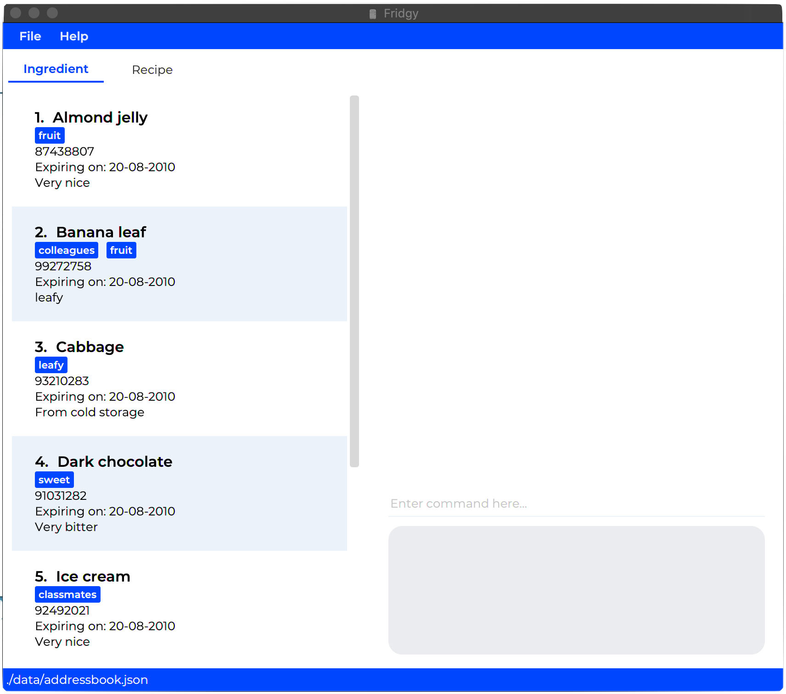
 
<i>When you first open Fridgy, it is filled with sample ingredients and recipes</i>

#### 2.1 Tutorial

Now that Fridgy is installed, you can test out the commands — add ingredients, recipes, and more!

Let us add our first ingredient:

`add ingredient -n Grapes -q 100g -e 25-10-2022 -d Seedless grapes`

This adds an ingredient named "Grapes", with a quantity of 100g, an expiry date of 25-10-2022, and a description of "Seedless grapes".

Then, add a recipe that uses that ingredient:

`add recipe -n Grape juice -i Grapes 50g -s Mash grapes -s Strain juice`

This adds a recipe named "Grape juice", which uses 50g of grapes, with two steps of preparation.

Finally, execute the recipe:

`cook recipe 1`

You would now have 50g of Grapes left.

Now that you are ready to use Fridgy, it is time to clear the sample entries and start adding your own:

`clear ingredient`, `clear recipe`

To exit Fridgy, type `exit`, or simply close the application window.

[\[Back to Table of Contents\]](#table-of-contents)

--------------------------------------------------------------------------------------------------------------------

## 3. UI

#### 3.1 Tabs
Click the `Ingredient` or `Recipe` tab each to show the contents of the Inventory or the Recipe Book respectively.
#### 3.2 Side Bar
A scrollable window that displays all the contents of the Inventory or the Recipe Book depending on the Tab selected
by the user.
#### 3.3 Cards
A card displays the details of each item inside the Inventory or the Recipe Book depending on the tab selected. Each card
represents **one** item.
#### 3.4 CommandLine
Command Line for users to key their commands into.
#### 3.5 CommandOutput
Output of the commands keyed in by users are displayed here.
#### 3.6 MainWindow
Displays the output of `View` command, which expands each ingredient or recipe card for better visibility.

[\[Back to Table of Contents\]](#table-of-contents)

---
## 4. Features

### 4.1 Command Notations Used

- Words between `<` and`>` are parameters to be supplied by the user.

  e.g. in `add ingredient -n <name>`, `<name>` is a parameter which can be used as: `add ingredient -n tomato`.

- Items in square brackets are optional.

  e.g. `add ingredient -n <name> [-d <description>]` can be used as:
     1. `add ingredient -n tomato -d from Africa` or as
     2. `add ingredient -n tomato`

  e.g. `add ingredient -n <name> -q <quantity>[<units>]` can be used as:
     1. `add ingredient -n chicken -q 2` or as
     2. `add ingredient -n chicken -q 2kg`

- Items with `…` after them can be used multiple times.

  e.g. `find ingredient <keyword>...`, can be used as: `find ingredient Strawberry Milk Cheese Tomato`

[\[Back to Table of Contents\]](#table-of-contents)

### 4.2 Command Overview

#### 4.2.1 Command Flags

 Flag | Usage | Description | Compulsory? | Remarks 
---- | ------- | ----------- | ------- | ----
`-n` | `-n <name>` | Name of the ingredient or recipe | Yes | Names can only contain alphanumeric characters or spaces.
`-q` | `-q <quantity> [<unit>]` | Quantity of the ingredient | Yes | Must be a number. Can be followed by a unit of measurement (`g`, `kg`, `mg`, `l`, `ml`, `kl`). Quantities will be converted to grams or litres, and numbers rounded off to 3 decimal places.
`-i` | `-i <ingredient>...` | Ingredients used in the recipe | At least one specified | Must be a name followed by a space and a quantity. Quantity can be followed by a unit of measurement (`g`, `kg`, `mg`, `l`, `ml`, `kl`).
`-e` | `-e <expiry date>` | Expiry date of ingredients | Yes | Must be in the form DD-MM-YYYY.
`-s` | `-s <step>...` | Step used in the recipe | No | Can contain any characters or spaces. 
`-d` | `-d <description>` | Description of the recipe or ingredient | No | Can contain any characters or spaces.
`-t` | `-t <tag>...` | Tag for the ingredient | No | Can contain alphanumeric characters or spaces. There can be at most 1 space between alphanumeric characters.

[\[Back to Table of Contents\]](#table-of-contents)

#### 4.2.2 Command Summary

Action | Format
--------|------------------
[**Add Ingredient**](#441-add-ingredient) | `add ingredient -n <name> -q <quantity>[<units>] -e <expiry date> [-d <description>]`
[**Delete Ingredient**](#442-delete-ingredient) | `delete ingredient <index>...`
[**Edit Ingredient**](#443-edit-ingredient) | `edit ingredient <index> [-n <name>] [-q <quantity> [<units>]] [-e <expiry date>] [-d <description>] [-t <tags>]...`
[**Clear Ingredient**](#444-clear-ingredient) | `clear ingredient [expired]`
[**Find Ingredient**](#445-find-ingredient) | `find ingredient <keyword>...`
[**List Ingredient**](#446-list-ingredient) | `list ingredient`
[**View Ingredient**](#447-view-ingredient) | `view ingredient <index>`
[**Add Recipe**](#451-add-recipe) | `add recipe -n <name> -i <ingredient>... [-d <description>] [-s <steps>]...`
[**Delete Recipe**](#452-delete-recipe) | `delete recipe <index>...`
[**Edit Recipe**](#453-edit-recipe) | `edit recipe <index> [-n <name>] [-i <ingredient>]... [-d <description>] [-s <steps>]...`
[**Clear Recipe**](#454-clear-recipe) | `clear recipe`
[**Find Recipe**](#455-find-recipe) | `find recipe <keyword>...`
[**List Recipe**](#456-list-recipe) | `list recipe`
[**View Recipe**](#457-view-recipe) | `view recipe <index>`
[**Cook Recipe**](#458-cook-recipe) | `cook recipe <index>`

[\[Back to Table of Contents\]](#table-of-contents)

### 4.3 General Commands

#### 4.3.1 Help
**Format:** 
`help`

Pops out a window that leads the user to [User Guide](https://ay2122s1-cs2103t-w11-1.github.io/tp/UserGuide.html)
(You are here).

#### 4.3.2 Exit
**Format:** 
`exit`

Closes the window and exits the program. All your information will be saved.

[\[Back to Table of Contents\]](#table-of-contents)

### 4.4 Ingredients
This section covers commands related to Inventory management. Any command primarily interacting with ingredients will 
be here.
- Note that by default, Fridgy will sort all Ingredients by expiry dates in descending order i.e. soonest expiring
  item will be at the top.
- If 2 ingredients' expiry dates are the same, they will be sorted in alphabetical order.

#### 4.4.1 Add Ingredient

Add an ingredient to the Inventory.

**Format:** 
`add ingredient -n <name> -q <quantity> [<units>] -e <expiry date> [-d <description>] [-t <tags>]...`

**Example(s):** 
1. Minimal command flags used: 
   Command: `add ingredient -n tomato -q 5 -e 20-02-2077`
    Expected Output: 
   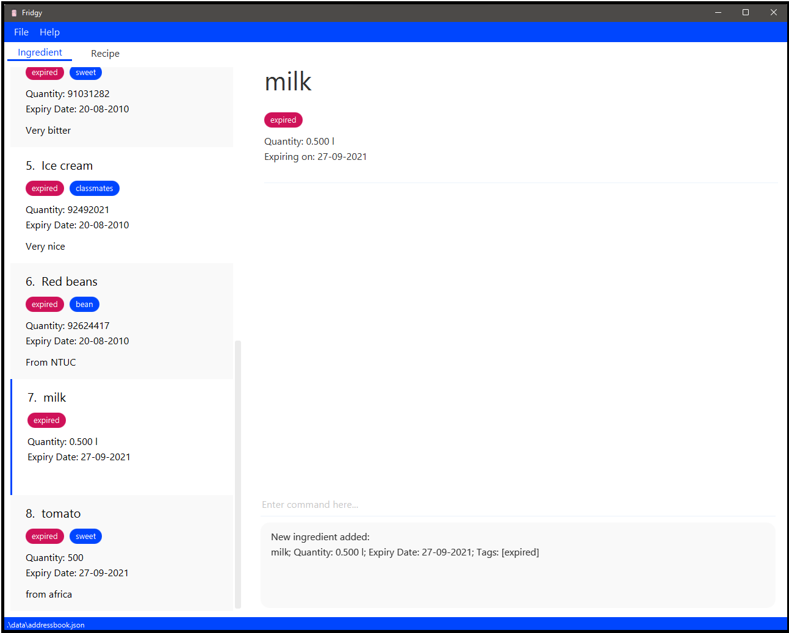  
    
2. All command flags used: 
   Command: `add ingredient -n flour -d fresh -q 500g -e 27-09-2021`
    Expected Output: 
   

 **Additional Information:** 
- Refer to the [Command Flags](#421-command-flags) table for information on each command flag.
    - Valid command flags are: `-n`, `-q`, `-d`, `-e`, `-t`
- Duplicate ingredients are not allowed. 
  - Duplicate ingredients refer to ingredients with the same name (ignoring case) and expiry date.
  - Users are allowed to keep track of ingredients with the same name (ignoring case) but different expiry dates.
- Any expired ingredients will be automatically tagged as expired.
- Any expiring ingredients (within 7 days from current date) will be automatically tagged as expiring.
- Please ensure that the ingredient names and the units used for quantities are consistent across the Inventory and the Recipe Book if you wish to
  use the [Cook Recipe](#458-cook-recipe) functionality.

[\[Back to Table of Contents\]](#table-of-contents)

#### 4.4.2 Delete Ingredient

Delete ingredient(s) from the Inventory.

**Format:** 
`delete ingredient <index>...`

**Example(s):** 
1. Command: `delete ingredient 2`
 Before: 
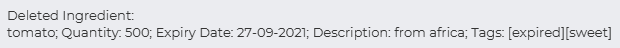
    
 After: 
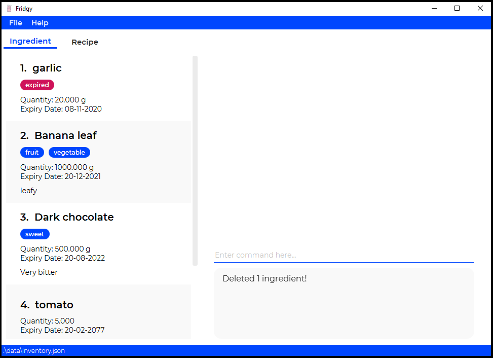

 **Additional Information:** 
- An index number is required for the Command. Refer to the indexes displayed for each [Card](#33-cards) in the
  [Side Bar](#32-side-bar).
- If multiple index numbers are specified, Fridgy will delete the ingredients at all specified index numbers.

[\[Back to Table of Contents\]](#table-of-contents)

#### 4.4.3 Edit Ingredient

Edit an ingredient from the Inventory.

**Format:** 
`edit ingredient <index> [-n <name>] [-q <quantity> [<units>]] [-e <expiry date>] [-d <description>] [-t <tags>]...`

**Example(s):** 
1. Command: `edit ingredient 1 -d juicy -t jelly`
 Before: 
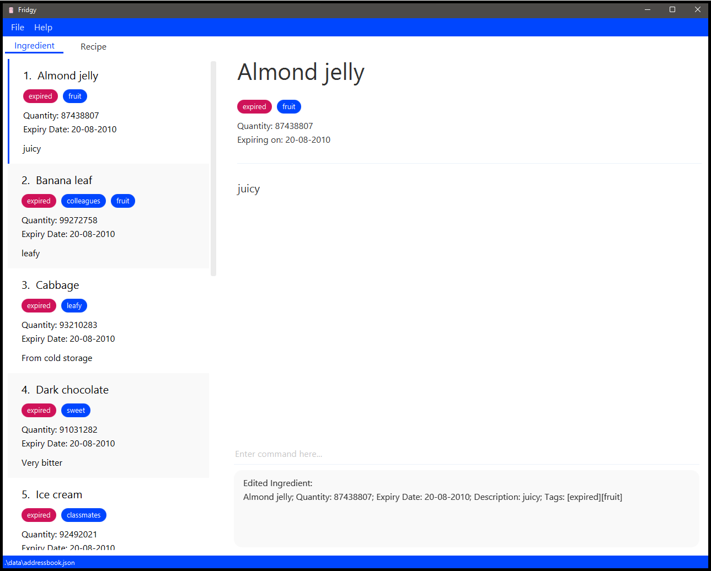
    
 After: 
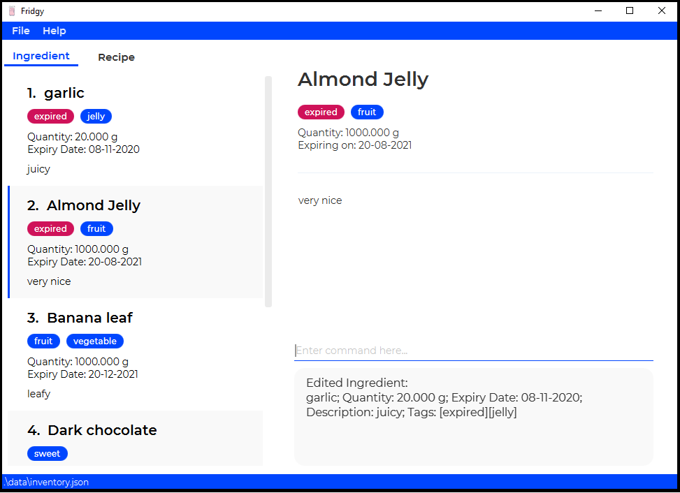

 **Additional Information:** 
- An index number is required for the Command. Refer to the indexes displayed for each [Card](#33-cards) in the
  [Side Bar](#32-side-bar).
- Refer to the [Command Flags](#421-command-flags) table for information on each command flag.
    - Valid command flags are: `-n`, `-q`, `-d`, `-e`, `-t`
- **At least one field** must be edited i.e. `edit ingredient 1` is not a valid command.
- Users are not allowed to edit an ingredient into duplicates of other ingredients.
    - Duplicate ingredients refer to ingredients with the same name (ignoring case) and expiry date.
    - Users are allowed to keep track of ingredients with the same name (ignoring case) but different expiry dates.
- Note that when editing the tags of an ingredient, all existing tags will be replaced with the new tags specified.
    - expired and expiring tags which are automatically added by Fridgy will not be affected.
    
[\[Back to Table of Contents\]](#table-of-contents)

#### 4.4.4 Clear Ingredient

Clear all the ingredients from the Inventory. Add `expired` keyword to only clear expired ingredients.

**Format:** 
`clear ingredient [expired]`

**Example(s):** 
1. Clear all ingredients: 
Command: `clear ingredient`
 Expected Output: 

      
2. Clear expired ingredients:  
Command: `clear ingredient expired`
 Before: 
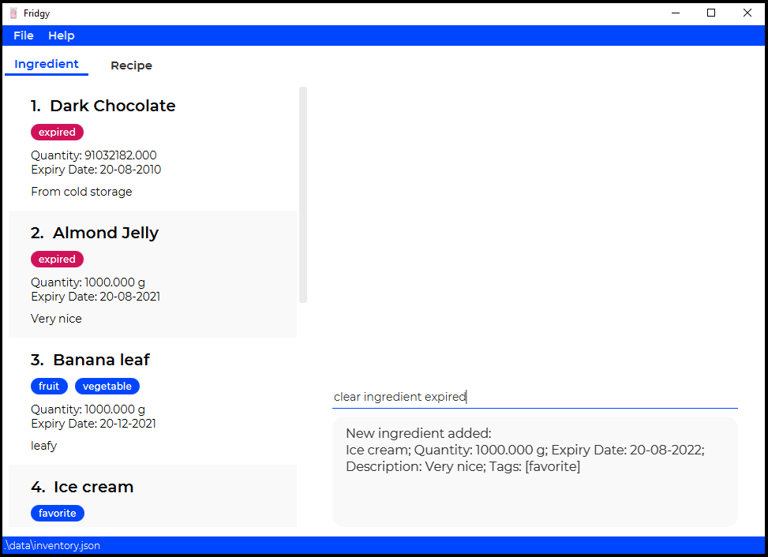
    
 After: 
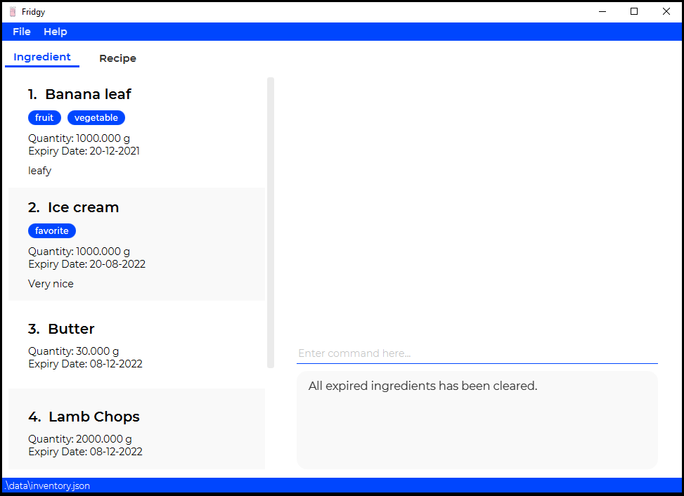   

[\[Back to Table of Contents\]](#table-of-contents)

#### 4.4.5 Find Ingredient

- Search for ingredient(s) from the Inventory based on user-inputted keyword(s) that match the **name** of ingredient(s).
- After a [Find Ingredient](#445-find-ingredient) command, to see the full list of ingredients again, please use a
[List Ingredient](#446-list-ingredient) command.

**Format:** 
`find ingredient <keyword>...`

**Example(s):** 
1. Command: `find ingredient banana cream`
 Expected Output: 
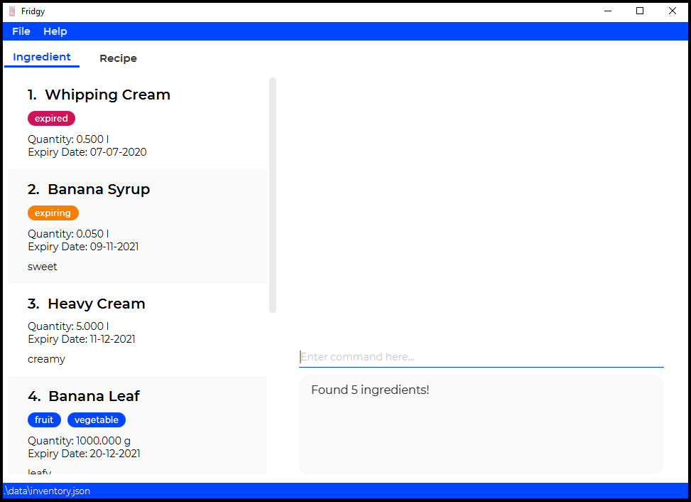

 **Additional Information:** 
- Keyword(s) are separated by spaces.
  - e.g. "corn chicken beef" will be regarded as "corn", "chicken" and "beef". 
Results will show matches for any of the 3 keywords.

- Match Criteria:
    1. Matching of keyword(s) is case-insensitive. 
       e.g. Finding with keyword: "corn" will match with "COrN"
    2. Ingredient(s) will be matched as long as a full keyword is in its name. 
       e.g. Finding with keyword: "corn" will match with "cornflour" and "corn flakes" but not "apple core".  

[\[Back to Table of Contents\]](#table-of-contents)

#### 4.4.6 List Ingredient

Switch to Ingredient [tab](#31-tabs) and list all ingredients.

**Format:** 
`list ingredient`

**Example(s):** 
1. Command: `list ingredient`
 Expected Output: 
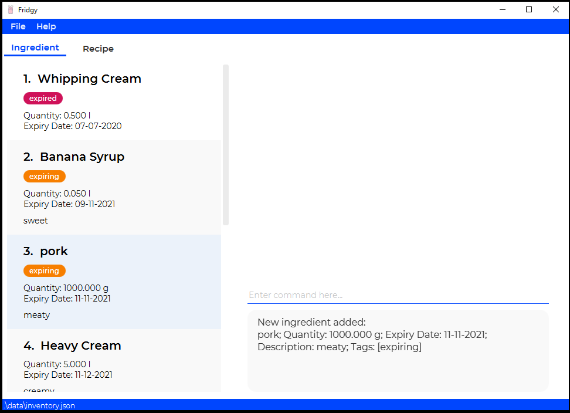

[\[Back to Table of Contents\]](#table-of-contents)

#### 4.4.7 View Ingredient

Open an ingredient in the [Main Window](#36-mainwindow).

**Format:** 
`view ingredient <index>`

**Example(s):** 
1. Command: `view ingredient 3`
 Expected Output: 
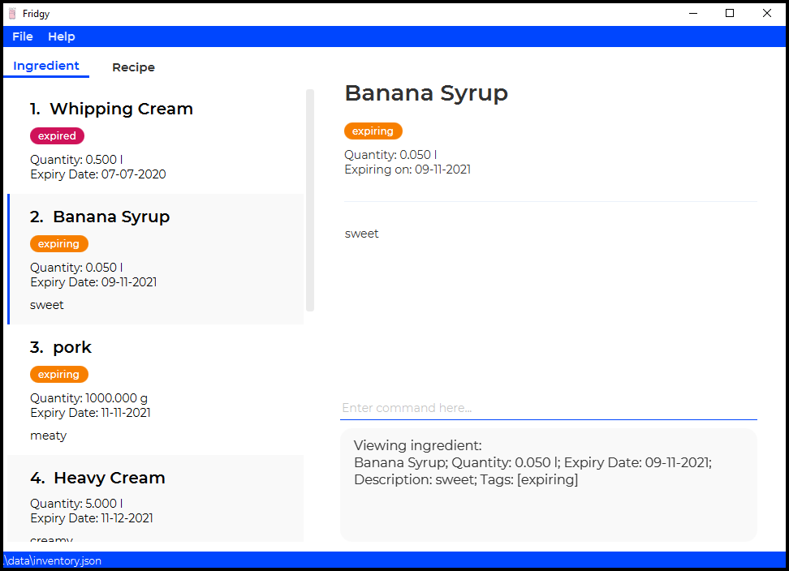

 **Additional Information:** 
- An index number is required for the Command. Refer to the indexes displayed for each [Card](#33-cards) in the
  [Side Bar](#32-side-bar).

[\[Back to Table of Contents\]](#table-of-contents)
  
### 4.5 Recipes
This sections covers commands related to Recipe Book management. Any command primarily interacting with recipes will
be here.

#### 4.5.1 Add Recipe

Add a recipe to the Recipe Book.

**Format:** 
`add recipe -n <name> -i <ingredient>... [-d <description>] [-s <steps>]...`

**Example(s):** 
1. Minimal command flags used:  
Command: `add recipe -n pasta -i tomato 2 -i linguine 50g`
 Expected Output: 
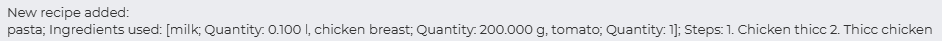
   
2. All command flags used: 
Command:`add recipe -n Grilled Lamb Chop with Mint Puree -i Mint 5g -i Lamb Chops 1kg -i Butter 20g -i Garlic 20g -s Season
the lamb chops with salt and pepper. -s Grill the lamb chops over medium high heat until cooked with butter.
-s Blend the mint with garlic to make a puree. -s Leave the lamb chops to rest for 5min. -s Serve with mint puree.
-d Juicy lamb chops served medium rare with a refreshing mint puree.`
 Expected Output: 

   
 **Additional Information:** 
- Refer to the [Command Flags](#421-command-flags) table for information on each command flag.
    - Valid command flags are: `-n`, `-i`, `-s`, `-d`
- Duplicate recipes are not allowed.
  - Duplicate recipes refer to recipes with the same name (ignoring case).
- Recipe ingredients will be highlighted red if they are missing or expired.  

[\[Back to Table of Contents\]](#table-of-contents)

#### 4.5.2 Delete Recipe

Delete recipe(s) from the Recipe Book.

**Format:** 
`delete recipe <index>...`

**Example(s):** 
1. Command: `delete recipe 4`
 Before: 
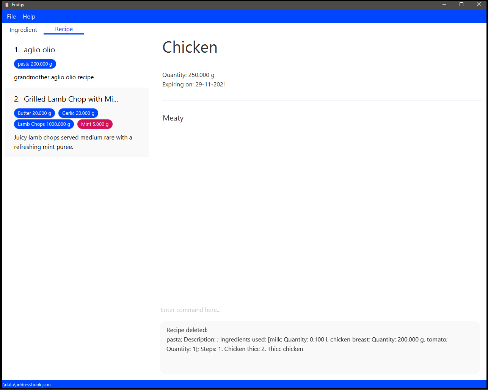
    
 After: 
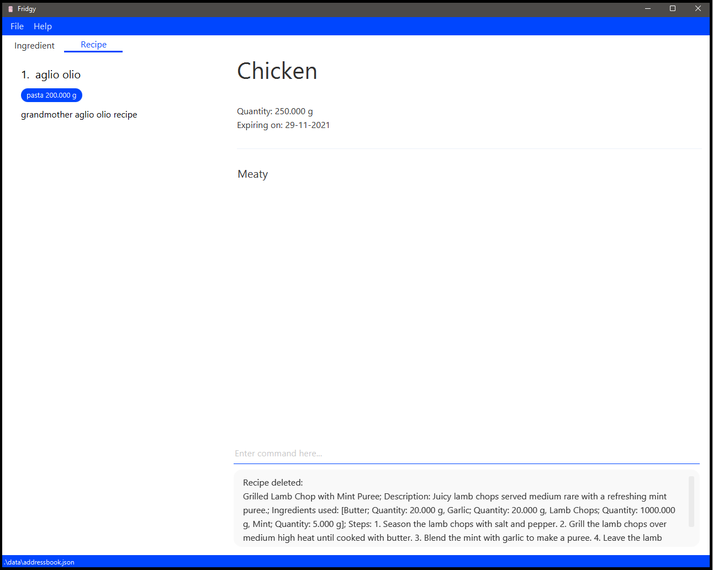

 **Additional Information:** 
- An index number is required for the Command. Refer to the indexes displayed for each [Card](#33-cards) in the
  [Side Bar](#32-side-bar).
- If multiple index numbers are specified, Fridgy will delete the recipes at all specified index numbers.

[\[Back to Table of Contents\]](#table-of-contents)
 
#### 4.5.3 Edit Recipe

Edit a recipe from the Recipe Book.

**Format**:  
`edit recipe <index> [-n <name>] [-i <ingredient>]... [-d <description>] [-s <steps>]...`

**Example(s):** 
1. Command: `edit recipe 2 -i pork knuckle 5kg -i apple juice 1l`
 Before: 
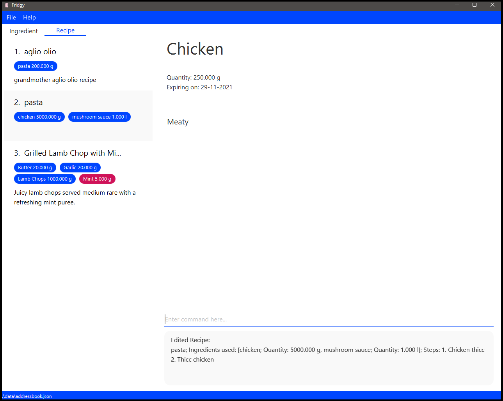
    
 After: 
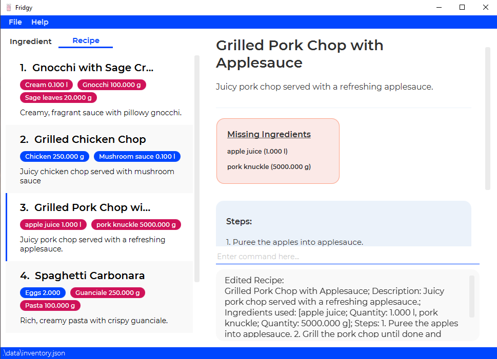

 **Additional Information:** 
- An index number is required for the Command. Refer to the indexes displayed for each [Card](#33-cards) in the
  [Side Bar](#32-side-bar).
- Refer to the [Command Flags](#421-command-flags) table for information on each command flag.
    - Valid command flags are: `-n`, `-i`, `-s`, `-d`
- **At least one field** must be edited i.e. `edit recipe 1` is not a valid command.
- Users are not allowed to edit a recipe into duplicates of other recipes.
  - Duplicate recipes refer to recipes with the same name (ignoring case).
- Note that when editing ingredients or steps, all existing ingredients or steps will be overwritten with the new
  ingredients or steps specified.

[\[Back to Table of Contents\]](#table-of-contents)

#### 4.5.4 Clear Recipe

Clear all recipes from the Recipe Book.

**Format:** 
`clear recipe`

**Example(s):** 
1. Command: `clear recipe`
 Expected Output:  
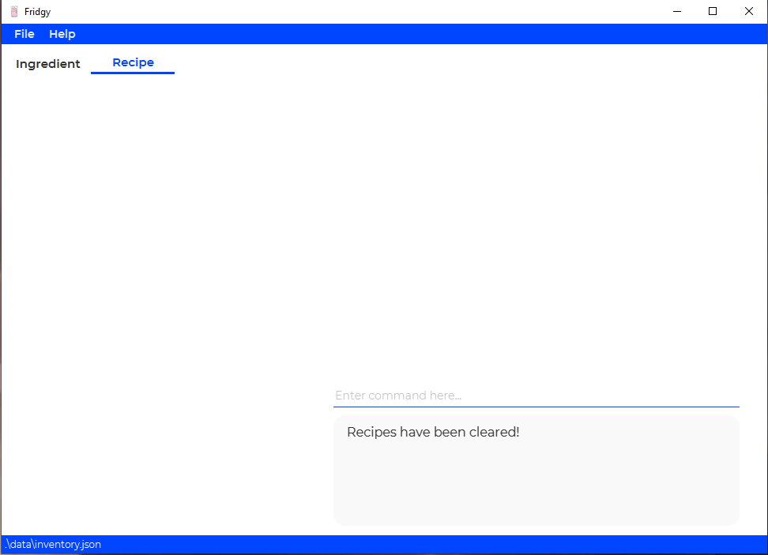

[\[Back to Table of Contents\]](#table-of-contents)

#### 4.5.5 Find Recipe

- Search for recipe(s) from the Recipe Book based on user-inputted keyword(s) that match the name of recipe(s).
- After a [Find Recipe](#455-find-recipe) command, to see the full list of recipes again, 
please use a [List Recipe](#456-list-recipe) command.

**Format:** :
`find recipe <keyword>...`

**Example(s):** 
1. Command: `find recipe chop sag`
    Expected Output: 
   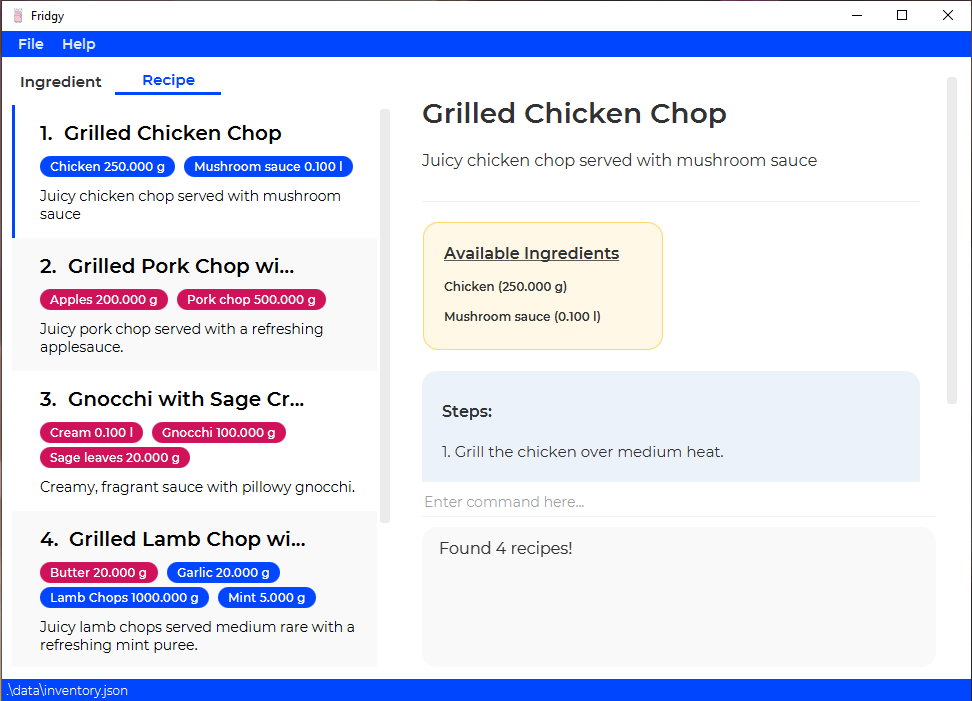

 **Additional Information:** 
- Keyword(s) are separated by spaces.
    - e.g. "corn chicken beef" will be regarded as "corn", "chicken" and "beef".
      Results will show matches for any of the 3 keywords.

- Match Criteria:
    1. Matching of keyword(s) is case-insensitive. 
       e.g. Finding with keyword: "corn" will match with "COrN"
    2. Ingredient(s) will be matched as long as a full keyword is in its name. 
       e.g. Finding with keyword: "corn" will match with "cornflour" and "corn flakes" but not "apple core".  

[\[Back to Table of Contents\]](#table-of-contents)

#### 4.5.6 List Recipe

Switch to Recipe [tab](#31-tabs) and list all recipes.

**Format:** 
`list recipe`

**Example(s):** 
1. Command: `list recipe`
  Expected Output: 
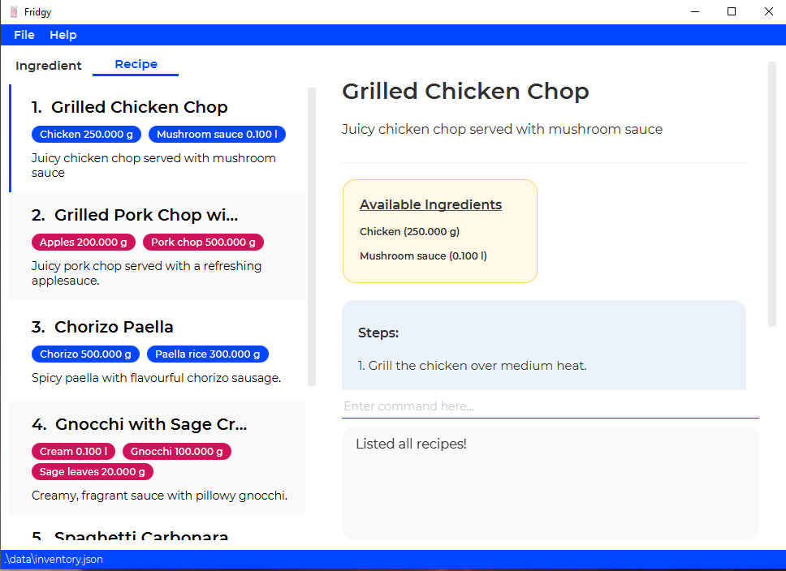

[\[Back to Table of Contents\]](#table-of-contents)

#### 4.5.7 View Recipe

Open a detailed view of a recipe in the [Main Window](#36-mainwindow).

**Format:** 
`view recipe <index>`

**Example(s):** 
1. Command: `view recipe 6`
    Expected Output: 
   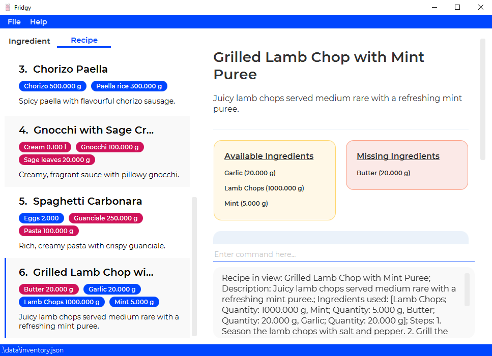

 **Additional Information:** 
- An index number is required for the Command. Refer to the indexes displayed for each [Card](#33-cards) in the
  [Side Bar](#32-side-bar).

[\[Back to Table of Contents\]](#table-of-contents)

#### 4.5.8 Cook Recipe

Cook a recipe and deduct the ingredients required by the chosen recipe from the Inventory.

**Format:** 
`cook recipe <index>`

**Example(s):** 
1. `cook recipe 6`
 Before: 
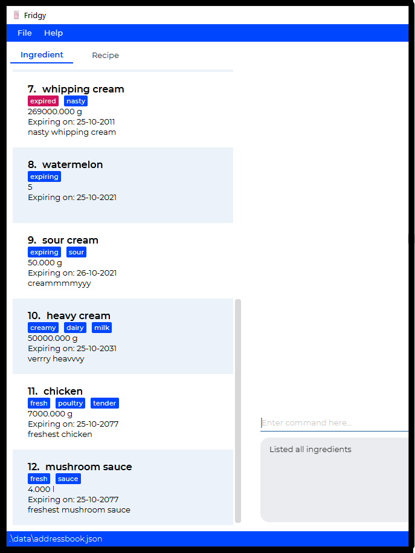
    
 After: 
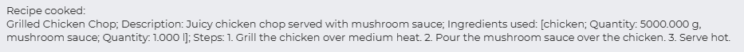
    
 Changes in Ingredients: 
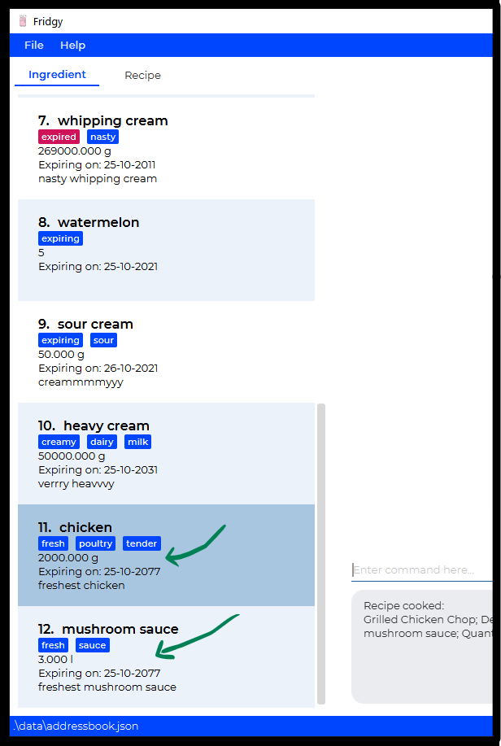

 **Additional Information:** 
- An index number is required for the Command. Refer to the indexes displayed for each [Card](#33-cards) in the
  [Side Bar](#32-side-bar).
- By default, Fridgy will use ingredients that are closest to expiry first when cooking a recipe.

[\[Back to Table of Contents\]](#table-of-contents)

---
## 5. Glossary

| Term | Definition |
|-----| -----|
| Alphanumeric | Containing alphabets (A to Z) or numbers (0 to 9) only. |
| Inventory | A list of ingredients stored and tracked by Fridgy. |
| Recipe Book | A list of recipes stored and tracked by Fridgy. |
| Command Line Interface | A means for a user to interact with an application through typing text commands. |
| Command Flag | A way to specify input options for a Command Line Interface-based application. |
| Graphical User Interface | A means for a user to interact with an application through pictorial icons such as buttons etc. |

[\[Back to Table of Contents\]](#table-of-contents)
