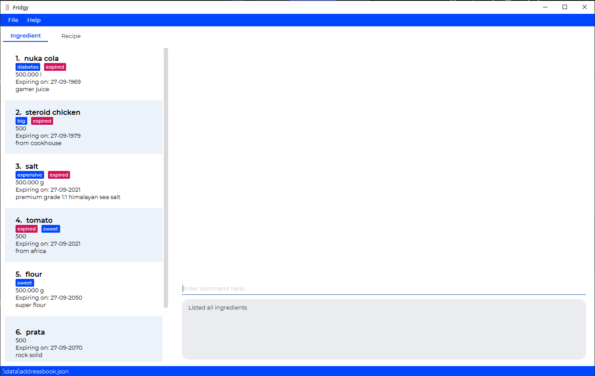
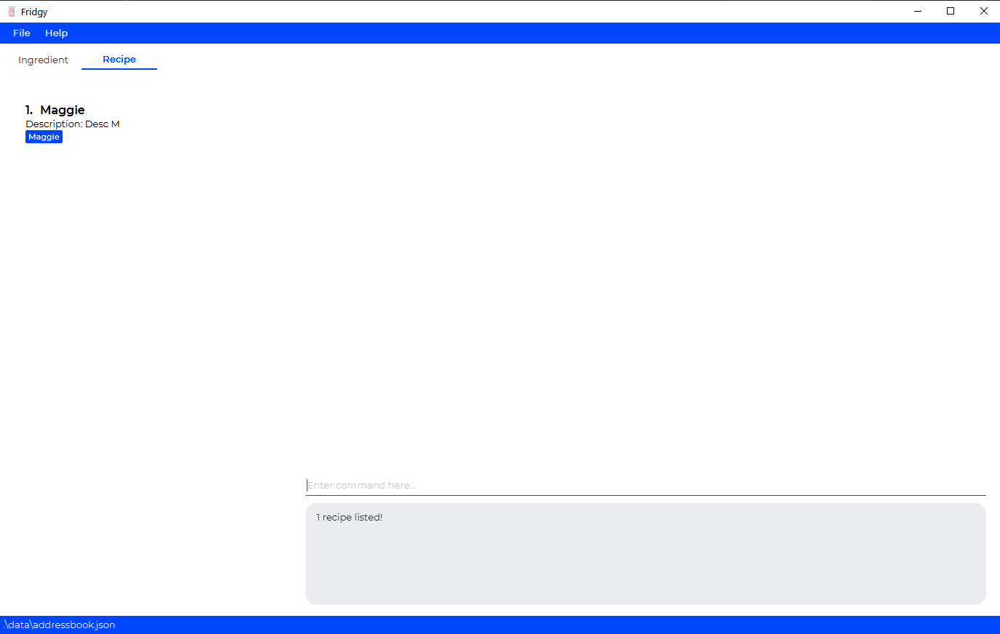
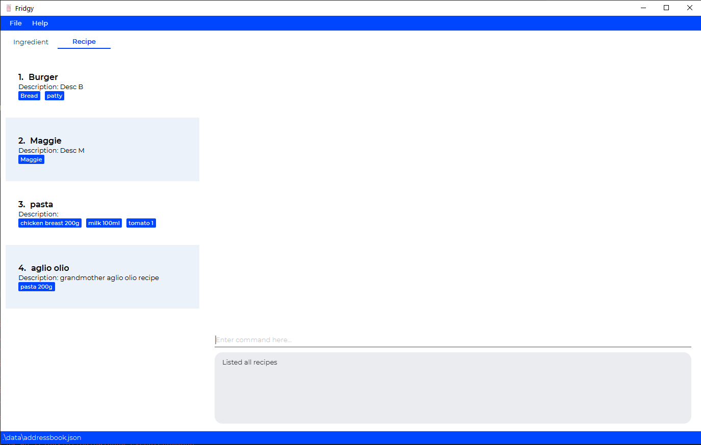

# Introduction

Fridgy is a **desktop app for managing an Inventory of food as well as a list of recipes, optimized for use via a Command Line Interface** (CLI) while still having the benefits of a Graphical User Interface (GUI). If you can type fast, Fridgy can get your fridge Inventory and recipe sorted out faster than traditional GUI apps.

--------------------------------------------------------------------------------------------------------------------
* Table of Contents
{:toc}

--------------------------------------------------------------------------------------------------------------------
# UI


# Features

**Notes about the Command Format:**

- Words between `<` and`>` are parameters to be supplied by the user.

  e.g. in `add ingredient -n <name>`, `<name>` is a parameter which can be used as:<br />`add ingredient -n tomato`.

- Items in square brackets are optional.

  e.g. `add ingredient -n <name> [-d <description>]` can be used as
     1. `add ingredient -n tomato -d from Africa` or as
     2. `add ingredient -n tomato`
     
  e.g. `add ingredient -n <name> -q <quantity>[<units>]` can be used as 
     1. `add ingredient -n chicken -q 2` or as
     2. `add ingredient -n chicken -q 2kg`

- Items with `…` after them can be used multiple times.

## General Commands

### Help
`help`

Pops out a window that leads the user to [User Guide](https://ay2122s1-cs2103t-w11-1.github.io/tp/UserGuide.html).

### Exit
`exit`

Exits the program.

## Ingredients

### Add Ingredients
`add ingredient`

Add an ingredient to the Inventory. 
- Any expired ingredients will be automatically tagged as `expired`.
- Any expiring (within 7 days from current date) will be automatically tagged as `expiring`.
- For Quantity, units of measurement are not necessary, but the following are accepted: 
  - Acceptable ingredient units are:
    1. grams: `g`
    2. litres: `l`
  - Acceptable prefixes for units are:
    1. milli- : `m` (i.e. `ml` for millilitres)
    2. kilo- : `k` (i.e. `kg` for kilograms)
  - All units will be converted to grams or litres, to 3 decimal places.

Format: `add ingredient -n <name> -q <quantity>[<units>] [-d <description>] -e <expiry date> [t <tags>]`

Example(s):
1. `add ingredient -n tomato -d from africa -q 500 -e 27-09-2021 -t sweet`
    <br />Expected Output:<br />
    ```
    New ingredient added: 
    tomato; Quantity: 500; Expiry Date: 27-09-2021; Description: from africa; Tags: [expired][sweet]
    ```


2. `add ingredient -n milk -q 500ml -e 27-09-2021`
    <br />Expected Output:<br />
    ```
    New ingredient added:
    milk; Quantity: 0.500 l; Expiry Date: 27-09-2021; Tags: [expired]
    ```


3. `add ingredient -n flour -d fresh -q 500g -e 27-09-2021`
    <br />Expected Output:<br />
    ```
    New ingredient added:
    flour; Quantity: 500.000 g; Expiry Date: 27-09-2021; Description: fresh; Tags: [expired]
    ```

### Delete Ingredients
`delete ingredient`

Delete an ingredient from the Inventory.

Format: `delete ingredient <index>`

Example(s):
1. `delete ingredient 1`
    <br />Expected Output:<br />
    ```
    Deleted Ingredient:
    tomato; Quantity: 500; Expiry Date: 27-09-2021; Description: from africa; Tags: [expired][sweet]
    ```

### Edit Ingredients
`edit ingredient`

Edit an ingredient from the Inventory.

Format: `edit ingredient <index> -<field flag> <new data>`

Example(s): 
1. `edit ingredient 1 -d juicy`
<br />Expected Output:<br />
    ```
    Edited Ingredient: 
    Watermelon; Quantity: 1; Expiry Date: 20-10-2021; Description: juicy; Tags: [expiring][melon][water]
    ```

### Clear Ingredients
`clear ingredient`

Clear all the ingredients from the Inventory.

Format: `clear ingredient`

Example(s):
1. `clear ingredient`
<br />Expected Output:<br />```Inventory has been cleared!```

### Find Ingredients
`find ingredient`

- Search for an ingredient from the Inventory based on a user-inputted keyword(s) that match the name of an ingredient(s).
- Current requirements for a keyword:
    1. Keyword is case-insensitive.<br />
       e.g. Finding with keyword: "corn" will match with "COrN"
    2. Any keyword must match a full word in the name of the recipe.<br />
       e.g. Finding with keyword: "corn" will match with "CoRN flour", "coRn FlakeS", etc. but not "popcorn" <br />
       e.g. Finding with keywords: "corn Chicken beef" will match "beef Chicken", "beef corn", etc. but not "beefcorn"
- After `find ingredient` command, to see the full list of ingredients again, please use `list ingredient` command.

Format: `find ingredient <keyword>...`

Example(s):
1. `find ingredient potato`
<br />Expected Output:<br />


### List Ingredients
`list ingredient`

List all the ingredients again after `find ingredient` Operation.

Format: `list ingredient`

Example(s):
1. `list ingredient`
<br />Expected Output:<br />


## Recipes

### Add Recipes
`add recipe`

Add a recipe to the Recipe Book.

Format: `add recipe -n <name> -i <ingredient> <quantity> [-d <optional description>] -s <steps>...`

Example(s):
1. `add recipe -n pasta -i tomato 1 -i milk 100ml -i chicken breast 200g -s Chicken thicc -s Thicc chicken`
    <br />Expected Output:
    ```
    New recipe added:
    pasta; Ingredients used: [tomato 1, chicken breast 200g, milk 100ml]; Steps: 1. Chicken thicc 2. Thicc chicken
    ```

2. `add recipe -n aglio olio -i pasta 200g -d grandmother aglio olio recipe -s aglioli olioli -s aglioli olioli`
    <br />Expected Output:
    ```
    New recipe added:
    aglio olio; Description: grandmother aglio olio recipe; Ingredients used: [pasta 200g]; Steps: 1. aglioli olioli 2. aglioli olioli
    ```

### Delete Recipes
`delete recipe`

Delete a recipe from the Recipe Book.

Format: `delete recipe <index>`

Example(s):
1. `delete recipe 1`
<br />Expected Output:
     ```
    Recipe deleted:
    pasta; Ingredients used: [tomato 1, chicken breast 200g, milk 100ml]; Steps: 1. Chicken thicc 2. Thicc chicken
     ```
2. `delete recipe 2`
   <br />Expected Output:
    ```
    Recipe deleted:
    aglio olio; Description: grandmother aglio olio recipe; Ingredients used: [pasta 200g]; Steps: 1. aglioli olioli 2. aglioli olioli
    ```

### Find Recipes
`find recipe`

- Search for a recipe from the Recipe Book based on a user-inputted keyword(s) that match the name of a recipe(s).
- Current requirements for a keyword:
  1. Keyword is case-insensitive.
     i. e.g. Finding with keyword: "mee" will match with "Maggie Mee"
  2. Any keyword must match a full word in the name of the recipe.
     i. e.g. Finding with keyword: "mee" will match with "Maggie Mee", "mee Goreng", etc. but not "meek"
     ii. e.g. Finding with keywords: "salad Chicken burger" will match "Fried Chicken", "Burger Chicken", "Salad", "Chicken Salad", etc. but not "chickenburger"
- After `find recipe` command, to see the full list of recipes again, please use `list recipe` command.


Format: `find recipe <keyword>...`

Example(s): 
1. `find recipe maggie`
<br />Expected output:


### List Recipes
`list recipe`

Lists out all the recipes again after `find recipe` operation. 

Format: `list recipe`

Example(s):
1. `list recipe`
<br /> Expected output:


### View Recipes
`view recipe`

Expand the recipe and view the detailed steps in a bigger window.

Format: `view recipe <index>`

Example(s):
1. `view recipe 4`<br />Expected Output:<br />


-----
# Command Summary

Action | Format
--------|------------------
**Add Ingredient** | `add ingredient -n <name> -q <quantity>[<units>] [-d <description>] -e <expiry date>`
**Delete Ingredient** | `delete ingredient <index>`
**Edit Ingredient** | `edit ingredient <index> (-<field flag> <new data>)...`
**Clear Ingredient** | `clear ingredient`
**Find Ingredient** | `find ingredient <keyword>...`
**List Ingredient** | `list ingredient`
**Add Recipe** | `add recipe -n <name> -i <ingredient> <quantity> [-d <optional description>] -s <steps>...`
**Delete Recipe** | `delete recipe <index>`
**Find Recipe** | `find recipe <keyword>...`
**List Recipe** | `list recipe`
**View Recipe** | `view recipe <index>`
