By: `Team Fridgy` 

* Table of Contents
{:toc}

--------------------------------------------------------------------------------------------------------------------
# 1. Introduction

Fridgy is a **food and recipe management system**, for users to manage their ingredients and recipes easily.

Fridgy helps you track your ingredients and recipes. It also warns you about expiring and expired ingredients, and automatically deducts your ingredients when you cook recipes.

Fridgy is made for people living in shared spaces, since fridges can get *very messy* and difficult to keep track of!

Fridgy is a *desktop app*, optimized for use via a Command Line Interface (CLI), while having an interactive Graphical User Interface (GUI) to display ingredients and recipes! If you can type fast, Fridgy can get your fridge Inventory and recipe sorted out faster than traditional GUI apps.

Want to know more? Jump to [Section 2, Quick Start](#2-quick-start) to get started.

## 1.1 Navigating the User Guide

This user guide aims to provide a comprehensive guide on how to use Fridgy. 
In addition, the quick start guide provides an end-to-end process to help you get started with installing Fridgy.

This User Guide covers:

1. Components of the user interface
2. Format and behaviour of Fridgy's commands
3. Usage examples, with step-by-step instructions
4. Other features

--------------------------------------------------------------------------------------------------------------------

# 2. Quick Start

1. Ensure you have Java 11 or above installed in your Computer.
2. Download the latest `fridgy.jar` [here](https://github.com/AY2122S1-CS2103T-W11-1/tp/releases).
3. Copy the file to the folder you want to use as the home folder for Fridgy.
4. Double-click the file to start the app. The GUI should appear in a few seconds. We've populated it with some sample ingredients and recipes for you to experiment with.

 
<i>When you first open Fridgy, it is filled with sample ingredients and recipes</i>

## 2.1 Tutorial

Now that Fridgy is installed, you can test out the commands — add ingredients, recipes, and more!

Adding our first ingredient:

`add ingredient -n Grapes -q 100g -e 25-10-2022 -d Seedless grapes`

Then, add a recipe that uses that ingredient:

`add recipe -n Grape juice -i Grapes 50g -s Mash grapes -s Strain juice`

Finally, execute the recipe:

`cook recipe 1`

The quantity of grapes would be deducted accordingly.

Now that you are ready to use Fridgy, you may use clear commands to clear out the sample entries:

`clear ingredient`
`clear recipe`

To exit Fridgy, simply close the application window.

--------------------------------------------------------------------------------------------------------------------

# 3. UI

### 3.1 Tabs
Click the `Ingredient` or `Recipe` tab each to show the contents of the Inventory or the RecipeBook respectively.
### 3.2 Side Bar
A scrollable window that displays all the contents of the Inventory or the RecipeBook depending on the Tab selected 
by the user.
### 3.3 Cards
A card displays the details of each item inside the Inventory or the RecipeBook depending on the tab selected. Each card 
represents **one** item.
### 3.4 CommandLine
Command Line for users to key their commands into.
### 3.5 CommandOutput
Output of the commands keyed in by users are displayed here.
### 3.6 MainWindow
Displays the output of `View` command, which expands each ingredient or recipe card for better visibility. 

---
# 4. Features

## 4.1 Command Notations Used

- Words between `<` and`>` are parameters to be supplied by the user.

  e.g. in `add ingredient -n <name>`, `<name>` is a parameter which can be used as: `add ingredient -n tomato`.

- Items in square brackets are optional.

  e.g. `add ingredient -n <name> [-d <description>]` can be used as:
     1. `add ingredient -n tomato -d from Africa` or as
     2. `add ingredient -n tomato`
  
  e.g. `add ingredient -n <name> -q <quantity>[<units>]` can be used as: 
     1. `add ingredient -n chicken -q 2` or as
     2. `add ingredient -n chicken -q 2kg`

- Items with `…` after them can be used multiple times.

  e.g. `find ingredient <keyword>...`, can be used as: `find ingredient Strawberry Milk Cheese Tomato`

## 4.2 Command Flags

 Flag | Usage | Description | Remarks 
---- | ------- | ----------- | -------
`-n` | `-n <name>` | Name of the ingredient or recipe | Names can only contain alphanumeric characters or spaces. Compulsory field.
`-q` | `-q <quantity> [unit]` | Quantity of the ingredient | Must be a number. Can be followed by a unit of measurement (`g`, `kg`, `mg`, `l`, `ml`, `kl`). Compulsory field.
`-i` | `-i <name> <quantity>...` | Ingredients used in the recipe | Must be a name followed by a space and a quantity. At least one must be specified. 
`-e` | `-e <expiry date>` | Expiry date of ingredients | Must be in the form DD-MM-YYYY. Compulsory field.
`-s` | `-s [step]...` | Step used in the recipe | Can contain any characters or spaces. Optional field.
`-d` | `-d [description]` | Description of the recipe or ingredient | Can contain any characters or spaces. Optional field. 
`-t` | `-t [tag]...` | Tag for the ingredient | Must be alphanumeric without spaces. Optional field.

## 4.3 General Commands

### 4.3.1 Help
**Format:** 
`help`

Pops out a window that leads the user to [User Guide](https://ay2122s1-cs2103t-w11-1.github.io/tp/UserGuide.html) 
(You are here).

### 4.3.2 Exit
**Format:** 
`exit`

Closes the window and exits the program. All your information will be saved. 

## 4.4 Ingredients
This section covers commands related to Inventory management. Any command primarily interacting with ingredients will 
be here.
- Note that by default, Fridgy will sort all Ingredients by expiry dates in descending order i.e. soonest expiring
  item will be at the top.

### 4.4.1 Add Ingredients

Add an ingredient to the Inventory. 

**Format:** 
`add ingredient -n <name> -q <quantity>[<units>] [-d <description>] -e <expiry date> [-t <tags>]`

**Example(s):** 
1. `add ingredient -n tomato -d from africa -q 500 -e 27-09-2021 -t sweet`
     Expected Output: 
    

2. `add ingredient -n milk -q 500ml -e 27-09-2021`
     Expected Output: 
    

3. `add ingredient -n flour -d fresh -q 500g -e 27-09-2021`
     Expected Output: 
    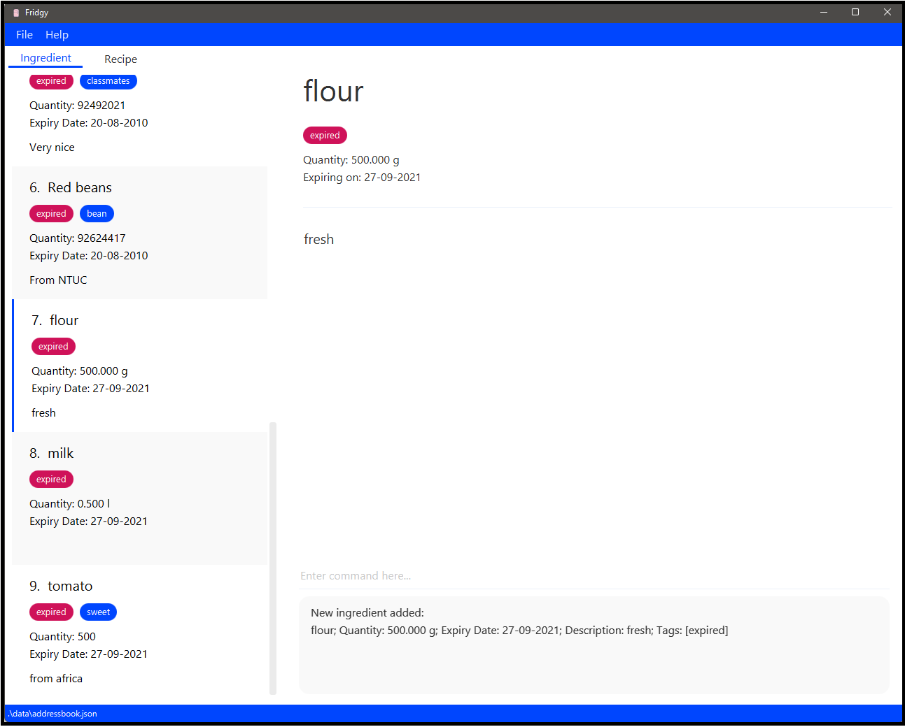

**Additional Information:** 
- Any expired ingredients will be automatically tagged as `expired`.
- Any expiring (within 7 days from current date) will be automatically tagged as `expiring`.
- For Quantity, units of measurement are not necessary, but the following are accepted:
    - Acceptable ingredient units are:
        1. grams: `g`
        2. litres: `l`
    - Acceptable prefixes for units are:
        1. milli- : `m` (i.e. `ml` for millilitres)
        2. kilo- : `k` (i.e. `kg` for kilograms)
    - All units will be converted to grams or litres, to 3 decimal places.
- Please ensure that the units used for quantity are consistent across the Inventory and the RecipeBook if you wish to
  use the [Cook Recipe](#438-cook-recipe) functionality.

### 4.4.2 Delete Ingredients

Delete ingredient(s) from the Inventory.

**Format:** 
`delete ingredient <index>...`

**Example(s):** 
1. `delete ingredient 2 3`
     Expected Output: 
    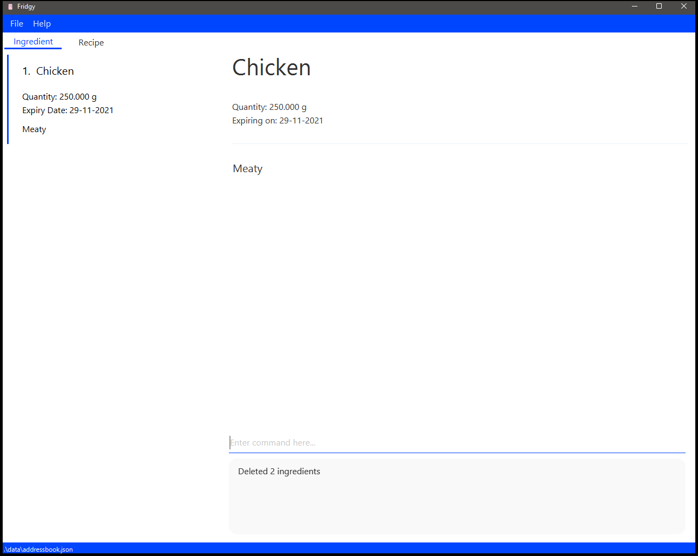

**Additional Information:** 
- An index number is required for the Command. Refer to the indexes displayed for each [Card](#33-cards) in the
  [Side Bar](#32-side-bar).
  
### 4.4.3 Edit Ingredients

Edit an ingredient from the Inventory.

**Format:** 
`edit ingredient <index> -<field flag> <new data>...`

**Example(s):** 
1. `edit ingredient 1 -d juicy -t fruit`
    Expected Output: 
   

**Additional Information:** 
- An index number is required for the Command. Refer to the indexes displayed for each [Card](#33-cards) in the
  [Side Bar](#32-side-bar).
A `field flag` is also required for each input field you wish to edit. You can refer to 
  [Add Command](#421-add-ingredients) for more examples on usage of each `field flag`. It can be any of the following:
    - `-n`: name of the ingredient
    - `-q`: quantity of the ingredient
    - `-d`: description of the ingredient
    - `-e`: expiry date of the ingredient
    - `-t`: tags for the ingredient
- Note that when editing the tags of an ingredient, all existing tags will be replaced with the new tags specified.

Example(s): 
1. `edit ingredient 1 -d juicy -t fruit`
 Expected Output: 

### 4.4.4 Clear Ingredients

Clear all the ingredients from the Inventory. Add `expired` keyword to only clear expired ingredients. 

**Format:** 
`clear ingredient [expired]`

**Example(s):** 
1. `clear ingredient`
 Expected Output: 

2. `clear ingredient expired`
 Expected output: 
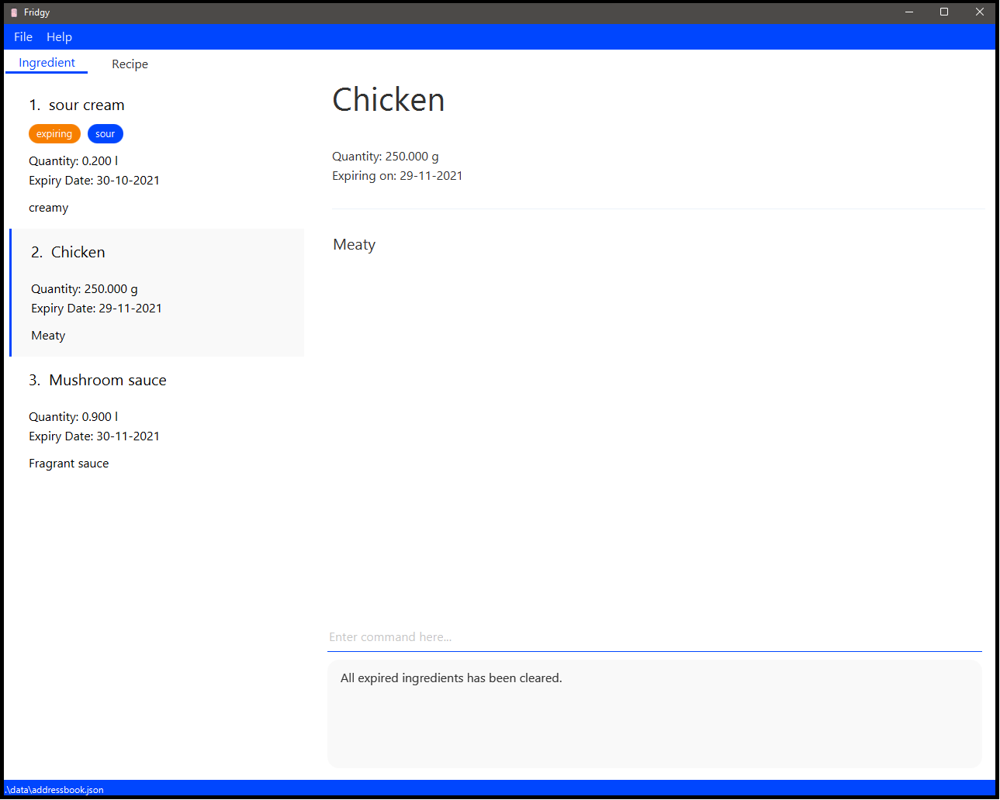

### 4.4.5 Find Ingredients

- Search for an ingredient from the Inventory based on a user-inputted keyword(s) that match the name of an ingredient(s).
- After [Find Ingredient](#425-find-ingredients) command, to see the full list of ingredients again, please use 
[List Ingredient](#426-list-ingredients) command.

**Format:** 
`find ingredient <keyword>...`

**Example(s):** 
1. `find ingredient cream`
    Expected Output: 
   

**Additional Information:** 
- Requirements for a keyword:
    1. Keyword is case-insensitive. 
       e.g. Finding with keyword: "corn" will match with "COrN"
       
    2. Any keyword must be contained in the name of the ingredient. 
       e.g. Finding with keyword: "corn" will match with "CoRN flour", "coRn FlakeS", "popcorn" but not "`"  
       e.g. Finding with keywords: "corn Chicken beef" will match "beef Chicken", "beef corn", etc. but not "beefcorn"

Example(s):
1. `find ingredient cream`
 Expected Output: 

### 4.4.6 List Ingredients

List all the ingredients again after `find ingredient` Operation.

**Format:** 
`list ingredient`

**Example(s):** 
1. `list ingredient`
 Expected Output: 
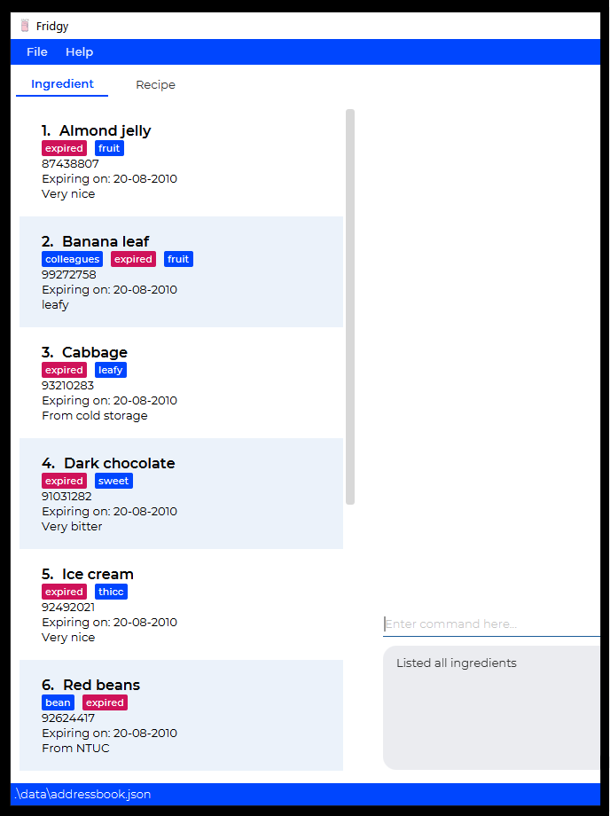
   
### 4.4.7 View Ingredients

View an ingredient in the [Main Window](#36-mainwindow).

**Format:** 
`view ingredient <index>`

**Example(s):** 
1. `view ingredient 3`
    Expected Output: 
   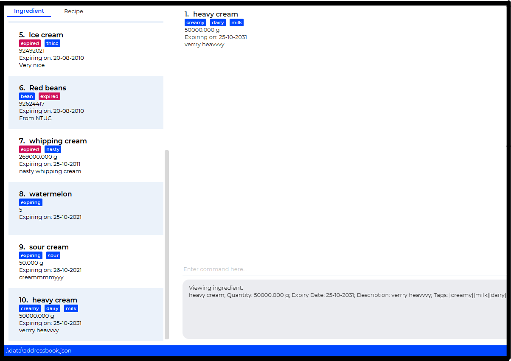

**Additional Information:** 
- An index number is required for the Command. Refer to the indexes displayed for each [Card](#33-cards) in the
  [Side Bar](#32-side-bar).

## 4.5 Recipes
This sections covers commands related to RecipeBook management. Any command primarily interacting with recipes will
be here.

### 4.5.1 Add Recipes

Add a recipe to the RecipeBook.

**Format:** 
`add recipe -n <name> -i <ingredient> <quantity> [-d <optional description>] [-s <steps>]...`

**Example(s):** 
1. `add recipe -n pasta -i tomato 1 -i milk 100ml -i chicken breast 200g -s Chicken thicc -s Thicc chicken`
     Expected Output: 
    

2. `add recipe -n aglio olio -i pasta 200g -d grandmother aglio olio recipe -s aglioli olioli -s aglioli olioli`
     Expected Output: 
    

3. `add recipe -n Grilled Lamb Chop with Mint Puree -i Mint 5g -i Lamb Chops 1kg -i Butter 20g -i Garlic 20g -s Season 
the lamb chops with salt and pepper. -s Grill the lamb chops over medium high heat until cooked with butter. 
-s Blend the mint with garlic to make a puree. -s Leave the lamb chops to rest for 5min. -s Serve with mint puree. 
-d Juicy lamb chops served medium rare with a refreshing mint puree.`
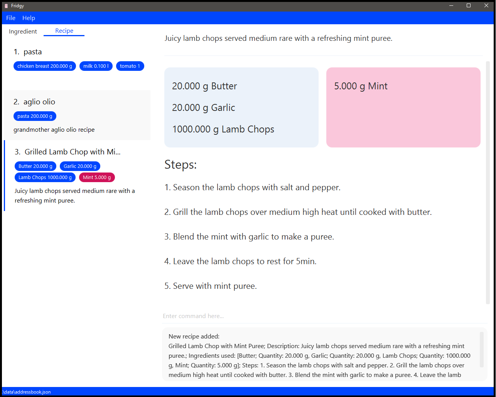
   
### 4.5.2 Delete Recipes

Delete a recipe from the RecipeBook. 

**Format:** 
`delete recipe <index>...`

**Example(s):** 
1. `delete recipe 2 3 4`
 Expected Output: 
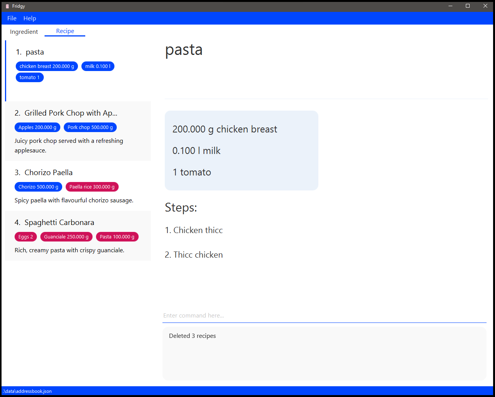

**Additional Information:** 
- An index number is required for the Command. Refer to the indexes displayed for each [Card](#33-cards) in the
  [Side Bar](#32-side-bar).
  
### 4.5.3 Clear Recipes

Clears all recipes from the Recipe Book.

**Format:** 
`clear recipe`

**Example(s):** 
1. `clear recipe`
     Expected Output:  
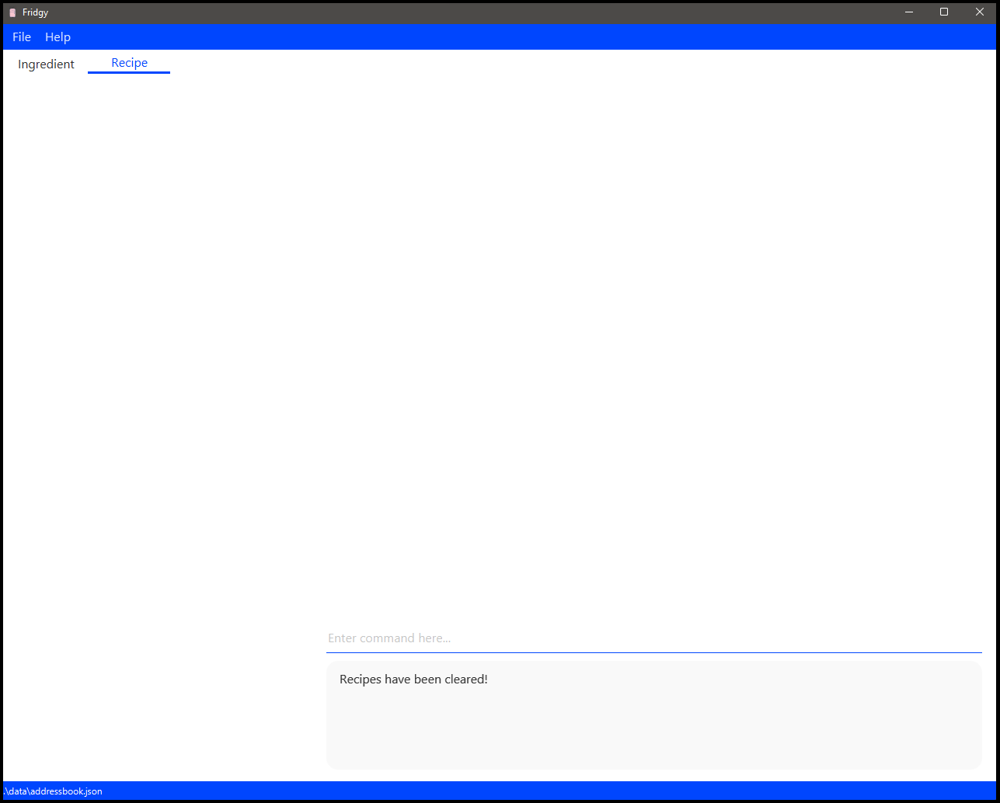
   
### 4.5.4 Edit Recipes

Edit a recipe from the Recipe Book.

**Format**:  
`edit recipe <index> <field flag><new data>...`

- An index number is required for the Command. Refer to the indexes displayed for each [Card](#cards) in the
  [Side Bar](#side-bar).
- A `field flag` is also required for each input field you wish to edit. You can refer to
  [Add Command](#add-recipes) for more examples on usage of each `field flag`. It can be any of the following:
  - `-n`: name of the recipe
  - `-i`: ingredients use in the recipe
  - `-s`: steps of the recipe
  - `-d`: description of the recipe
- Note that when editing ingredients or steps, all existing ingredients or steps will be overwritten with the new
ingredients or steps specified.

**Example(s):** 
1. `edit recipe 2 -i chicken 5kg -i mushroom sauce 1l`
    Expected Output: 
   

**Additional Information:** 
- An index number is required for the Command. Refer to the indexes displayed for each [Card](#33-cards) in the
  [Side Bar](#32-side-bar).
A `field flag` is also required for each input field you wish to edit. You can refer to
  [Add Command](#431-add-recipes) for more examples on usage of each `field flag`. It can be any of the following:
- `-n`: name of the recipe
- `-i`: ingredients use in the recipe
- `-s`: steps of the recipe
- `-d`: description of the recipe

### 4.5.5 Find Recipes

- Search for a recipe from the RecipeBook based on a user-inputted keyword(s) that match the name of a recipe(s).
- After [Find Recipes](#435-find-recipes) command, to see the full list of recipes again, 
please use [List Recipes](#436-list-recipes) command.

**Format:** :
`find recipe <keyword>...`

**Example(s):** 
1. `find recipe chop`
    Expected Output: 
   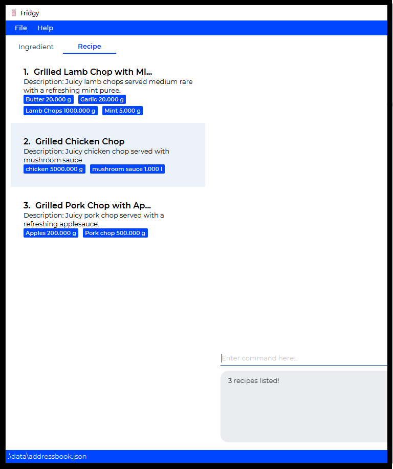

**Additional Information:** 
- Current requirements for a keyword:
    1. Keyword is case-insensitive. 
        1. e.g. Finding with keyword: "mee" will match with "Maggie Mee"
    2. Any keyword must match the name of the recipe either partially or fully.
        1. e.g. Finding with keyword: "mee" will match with "Maggie Mee" but not "Me"
        2. e.g. Finding with keywords: "salad Chicken burger" will match "Fried Chicken", "Burger Chicken", "Salad",
       "Chicken Salad" and "chickenburger"
           
Example(s): 
1. `find recipe chop`
 Expected Output: 

### 4.5.6 List Recipes

Lists out all the recipes again after `find recipe` operation. 

**Format:** 
`list recipe`

**Example(s):** 
1. `list recipe`
  Expected Output: 
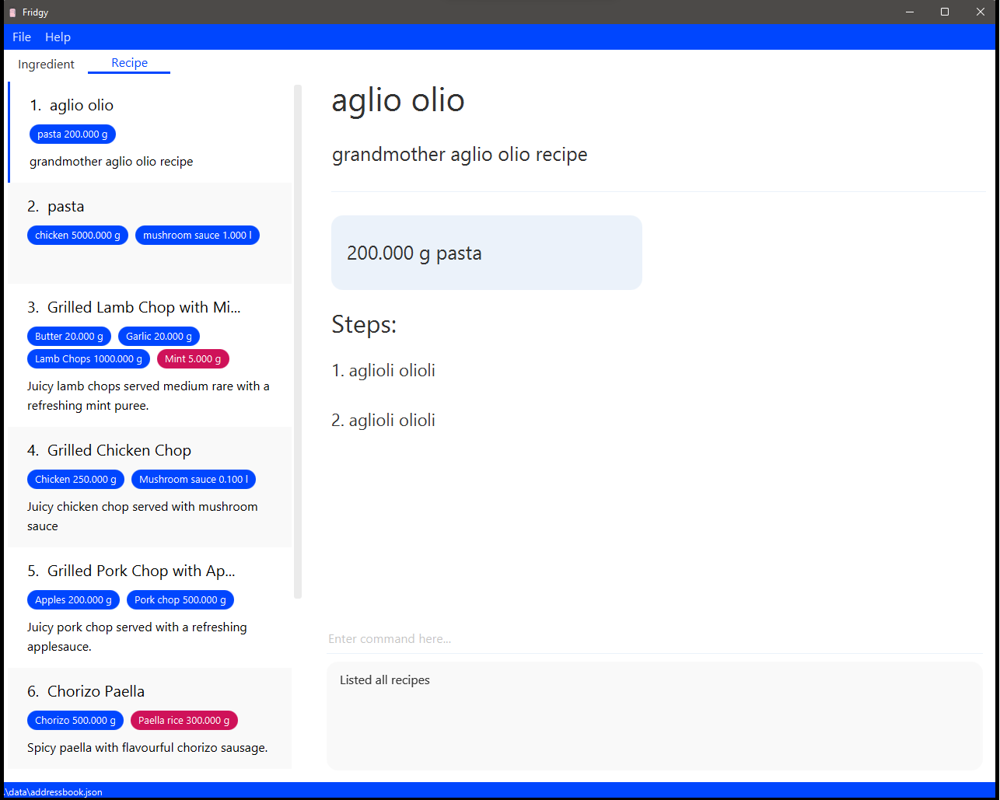
   
### 4.5.7 View Recipes

Expand the recipe and view the detailed steps in a bigger window.

**Format:** 
`view recipe <index>`

**Example(s):** 
1. `view recipe 4`
    Expected Output: 
   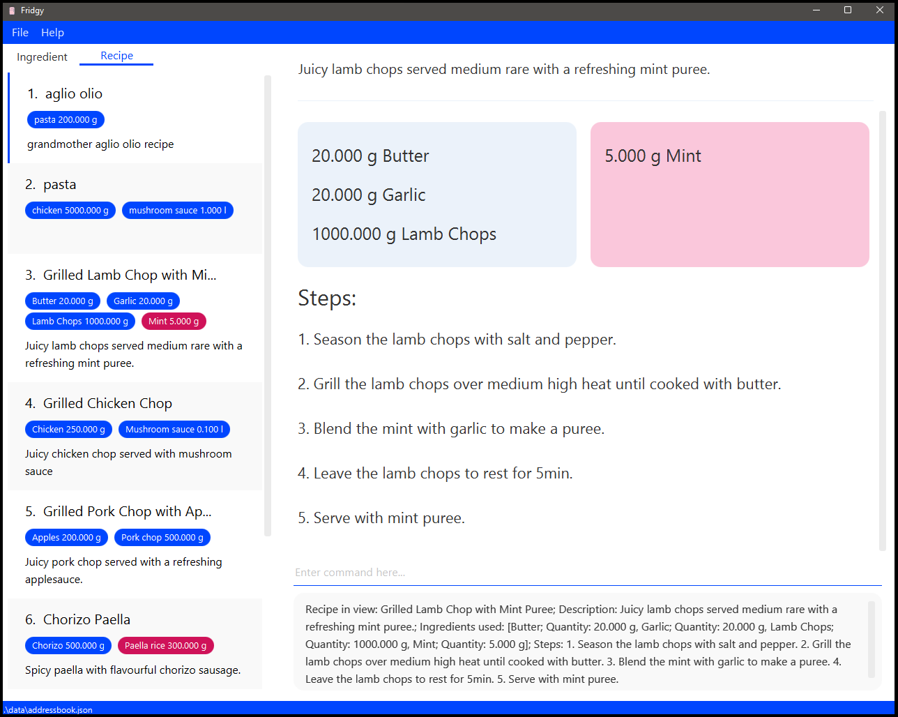

**Additional Information:** 
- An index number is required for the Command. Refer to the indexes displayed for each [Card](#33-cards) in the
  [Side Bar](#32-side-bar).

### 4.5.8 Cook Recipe

Cooks a recipe and deducts the ingredients required by the chosen recipe from the Inventory.

**Format:** 
`cook recipe <index>`

**Example(s):** 
1. `cook recipe 2`
    Ingredients Before Cooking: 
   
    Ingredients After Cooking: 
   

**Additional Information:** 
- An index number is required for the Command. Refer to the indexes displayed for each [Card](#33-cards) in the
  [Side Bar](#32-side-bar).

-----
# 5. Command Summary

Action | Format
--------|------------------
**Add Ingredient** | `add ingredient -n <name> -q <quantity>[<units>] [-d <description>] -e <expiry date>`
**Delete Ingredient** | `delete ingredient <index>...`
**Edit Ingredient** | `edit ingredient <index> (-<field flag> <new data>)...`
**Clear Ingredient** | `clear ingredient [expired]`
**Find Ingredient** | `find ingredient <keyword>...`
**List Ingredient** | `list ingredient`
**View Ingredient** | `view ingredient <index>`
**Add Recipe** | `add recipe -n <name> -i <ingredient> <quantity> [-d <optional description>] [-s <steps>]...`
**Delete Recipe** | `delete recipe <index>...`
**Edit Recipe** | `edit recipe <index> (-<field flag> <new data>)...`
**Find Recipe** | `find recipe <keyword>...`
**List Recipe** | `list recipe`
**View Recipe** | `view recipe <index>`
**Cook Recipe** | `cook recipe <index>`
